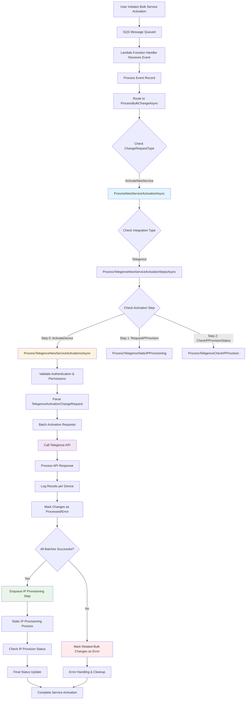

# Activate New Service Data Flow Analysis - DeviceBulkChange Repository

## 📊 Overview

This document provides a comprehensive analysis of the data flow for the "Activate New Service" functionality in the `AltaworxDeviceBulkChange.cs` lambda function, including complete code evidence and step-by-step tracing.

## 🔄 Complete Data Flow Diagram



---

## 📋 Step-by-Step Data Flow with Code Evidence

### **Step 1: SQS Event Reception**
**Code Location**: Lines 138-145
```csharp
public async Task FunctionHandler(SQSEvent sqsEvent, ILambdaContext context)
{
    KeySysLambdaContext keysysContext = null;
    this.bulkChangeRepository = new BulkChangeRepository();
    long bulkChangeId = 0;
    try
    {
        keysysContext = BaseFunctionHandler(context);
        // Processing logic starts here
    }
}
```

**Purpose**: Lambda function entry point that receives SQS events containing bulk change requests.

---

### **Step 2: Event Processing & Routing**
**Code Location**: Lines 204-212, 475-481
```csharp
private async Task<long> ProcessEventAsync(KeySysLambdaContext context, SQSEvent sqsEvent)
{
    LogInfo(context, LogTypeConstant.Sub, "ProcessEventAsync");
    if (sqsEvent.Records.Count > 0)
    {
        if (sqsEvent.Records.Count == 1)
        {
            return await ProcessEventRecordAsync(context, sqsEvent.Records[0]);
        }
    }
}

// Routing based on change request type
switch (bulkChange.ChangeRequestType.ToLowerInvariant())
{
    case ChangeRequestType.StatusUpdate:
        var changes = GetDeviceChanges(context, bulkChange.Id, bulkChange.PortalTypeId, PageSize).ToList();
        return await ProcessStatusUpdateAsync(context, logRepo, bulkChange, changes, retryNumber);
    case ChangeRequestType.ActivateNewService:
        return await ProcessNewServiceActivationAsync(context, logRepo, bulkChange, message, additionBulkChangeId, retryNumber);
    // ... other cases
}
```

**Purpose**: Routes the bulk change request to the appropriate processing method based on the change type.

---

### **Step 3: New Service Activation Entry Point**
**Code Location**: Lines 2639-2654
```csharp
private async Task<bool> ProcessNewServiceActivationAsync(KeySysLambdaContext context, DeviceBulkChangeLogRepository logRepo,
    BulkChange bulkChange, SQSEvent.SQSMessage message, long additionBulkChangeId, int retryNumber)
{
    LogInfo(context, LogTypeConstant.Sub, "ProcessNewServiceActivationAsync()");
    LogInfo(context, LogTypeConstant.Info, $"Bulk Change Id: {bulkChange.Id}");

    switch (bulkChange.IntegrationId)
    {
        case (int)IntegrationType.Telegence:
            return await ProcessTelegenceNewServiceActivationStepsAsync(context, logRepo, bulkChange, message, additionBulkChangeId, retryNumber);
        default:
            throw new Exception($"Error Activating New Service {bulkChange.Id}: Integration Type {bulkChange.IntegrationId} is unsupported.");
    }
}
```

**Purpose**: Entry point for new service activation that routes to provider-specific implementation.

---

### **Step 4: Telegence Multi-Step Activation Process**
**Code Location**: Lines 2655-2687
```csharp
private async Task<bool> ProcessTelegenceNewServiceActivationStepsAsync(KeySysLambdaContext context, DeviceBulkChangeLogRepository logRepo,
    BulkChange bulkChange, SQSEvent.SQSMessage message, long additionBulkChangeId, int retryNumber)
{
    LogInfo(context, LogTypeConstant.Sub, "Start Process Telegence New Service Activation Steps Async");

    long processStep = 0;

    if (message.MessageAttributes.ContainsKey("TelegenceNewServiceActivationStep") && !string.IsNullOrWhiteSpace(message.MessageAttributes["TelegenceNewServiceActivationStep"].StringValue))
    {
        processStep = long.Parse(message.MessageAttributes["TelegenceNewServiceActivationStep"].StringValue);
    }
    LogInfo(context, LogTypeConstant.Info, $"Telegence New Activation Step: {processStep}");

    switch (processStep)
    {
        case (int)TelegenceNewActivationStep.ActivateDevice:
            var changes = GetDeviceChanges(context, bulkChange.Id, bulkChange.PortalTypeId, PageSize);

            if (changes == null || changes.Count == 0)
            {
                LogInfo(context, LogTypeConstant.Warning, $"No unprocessed changes found for new service activation {bulkChange.Id}");
                return true;
            }

            return await ProcessTelegenceNewServiceActivationsAsync(context, logRepo, bulkChange, changes, additionBulkChangeId, retryNumber);
        case (int)TelegenceNewActivationStep.RequestIPProvision:
            return await ProcessTelegenceStaticIPProvisioning(context, bulkChange, message);
        case (int)TelegenceNewActivationStep.CheckIPProvisionStatus:
            return await ProcessTelegenceCheckIPProvision(context, bulkChange, message);
        default:
            throw new Exception($"Error Activating New Service {bulkChange.Id}: Integration Type {bulkChange.IntegrationId} is unsupported.");
    }
}
```

**Purpose**: Manages the multi-step Telegence activation process:
- **Step 0**: Device activation
- **Step 1**: Static IP provisioning request  
- **Step 2**: IP provisioning status check

---

### **Step 5: Core Telegence Activation Processing**
**Code Location**: Lines 3009-3080
```csharp
private async Task<bool> ProcessTelegenceNewServiceActivationsAsync(KeySysLambdaContext context,
    DeviceBulkChangeLogRepository logRepo, BulkChange bulkChange, ICollection<BulkChangeDetailRecord> changes, long additionBulkChangeId, int retryNumber)
{
    var serviceProviderId = bulkChange.ServiceProviderId;
    LogInfo(context, LogTypeConstant.Info, $"Telegence: Processing New Service Activation for Service Provider: {serviceProviderId}");
    var telegenceApiAuthentication = GetTelegenceApiAuthentication(context.CentralDbConnectionString, serviceProviderId);

    // Pre-flight checks
    if (telegenceApiAuthentication == null)
    {
        var errorMessage = $"Unable to get Telegence API Authentication for Service Provider: {serviceProviderId}";
        LogInfo(context, LogTypeConstant.Error, errorMessage);
        await MarkProcessedForNewServiceActivationAsync(context, bulkChange.Id, false, errorMessage, null);
        return false;
    }

    if (!telegenceApiAuthentication.WriteIsEnabled)
    {
        var errorMessage = $"Write is disabled for Service Provider: {serviceProviderId}";
        LogInfo(context, LogTypeConstant.Error, errorMessage);
        await MarkProcessedForNewServiceActivationAsync(context, bulkChange.Id, false, errorMessage, null);
        return false;
    }
}
```

**Purpose**: Validates authentication and permissions before proceeding with activation.

---

### **Step 6: Request Parsing & Preparation**
**Code Location**: Lines 3081-3095
```csharp
var telegenceActivationListItems = new List<TelegenceActivationRequest>();
var carrierDataGroup = string.Empty;
var carrierRatePool = string.Empty;
foreach (var change in changes)
{
    LogInfo(context, LogTypeConstant.Info, $"Processing Change: {change.Id} with change request: {change.ChangeRequest}");
    var telegenceChangeRequest = JsonConvert.DeserializeObject<TelegenceActivationChangeRequest>(change.ChangeRequest);

    telegenceActivationListItems.Add(telegenceChangeRequest.TelegenceActivationRequest);
    carrierDataGroup = telegenceChangeRequest.CarrierDataGroup;
    carrierRatePool = telegenceChangeRequest.CarrierRatePool;
}
```

**Purpose**: Deserializes change requests and extracts Telegence activation parameters.

---

### **Step 7: Batch Processing & API Calls**
**Code Location**: Lines 3096-3150
```csharp
var isAllBatchesSuccess = true;
var activationListInBatches = telegenceActivationListItems.SplitCollection(MAX_TELEGENCE_SERVICES_PER_REQUEST);
int index = 0;

foreach (var telegenceActivationList in activationListInBatches)
{
    LogInfo(context, CommonConstants.INFO, $"Processing batch {index} of {activationListInBatches.Count()}");
    var httpRetryPolicy = GetHttpRetryPolicy(context);

    // Filter remove ServiceCharacteristic ("remove offering code")
    var tlActivationListSliceRemoveOfferingCode = telegenceActivationList.Select(t => new TelegenceActivationRequest()
    {
        BillingAccount = t.BillingAccount,
        RelatedParty = t.RelatedParty,
        Service = new Amop.Core.Models.Telegence.Api.Service()
        {
            Category = t.Service.Category,
            Error = t.Service.Error,
            Name = t.Service.Name,
            ServiceSpecification = t.Service.ServiceSpecification,
            ServiceCharacteristic = t.Service.ServiceCharacteristic.Where(t => !t.Name.Equals(Common.CommonString.REMOVE_SOC_CODE_STRING)).ToList(),
            Status = t.Service.Status,
            SubscriberNumber = t.Service.SubscriberNumber,
            ServiceQualification = t.Service.ServiceQualification
        }
    }).ToList();

    await httpRetryPolicy.ExecuteAsync(async () =>
    {
        apiResult = await _telegenceApiPostClient.ActivateDevicesAsync(tlActivationListSliceRemoveOfferingCode, TelegenceDeviceStatusUpdateURL, httpClient);
    });
}
```

**Purpose**: 
- Splits large requests into batches (max 200 services per request)
- Filters out offering codes as required
- Makes HTTP API calls to Telegence with retry policy

---

### **Step 8: Response Processing & Logging**
**Code Location**: Lines 3151-3180
```csharp
var isSuccessful = !apiResult?.HasErrors ?? false;
if (!isSuccessful)
{
    isAllBatchesSuccess = false;
    LogVariableValue(context, nameof(apiResult.ResponseObject.ErrorMessage), apiResult.ResponseObject.ErrorMessage);
}

// Logging into each change based on iccid
foreach (var requestedDevice in telegenceActivationList)
{
    var iccid = requestedDevice.Service.ServiceCharacteristic.FirstOrDefault(sc => sc.Name == "sim")?.Value;

    // Create bulkchange log activate new service 
    logRepo.AddMobilityLogEntry(new CreateMobilityDeviceBulkChangeLog()
    {
        BulkChangeId = bulkChange.Id,
        ErrorText = apiResult.HasErrors ? JsonConvert.SerializeObject(apiResult.ResponseObject.TelegenceActivationResponse) : null,
        HasErrors = apiResult.HasErrors,
        LogEntryDescription = "Telegence New Service Activation: Telegence API",
        MobilityDeviceChangeId = (long)(changes.FirstOrDefault(ch => ch.ICCID == iccid)?.Id),
        ProcessBy = "AltaworxDeviceBulkChange",
        ProcessedDate = DateTime.UtcNow,
        ResponseStatus = isSuccessful ? BulkChangeStatus.PENDING : BulkChangeStatus.ERROR,
        RequestText = apiResult.ActionText + Environment.NewLine + JsonConvert.SerializeObject(apiResult.RequestObject),
        ResponseText = apiResult.ResponseObject != null ? JsonConvert.SerializeObject(apiResult.ResponseObject) : string.Empty
    });
}
```

**Purpose**: 
- Processes API responses
- Creates detailed logs for each device in the batch
- Sets appropriate status (PENDING or ERROR)

---

### **Step 9: Database Status Updates**
**Code Location**: Lines 3181-3199, 5662-5685
```csharp
// Mark changes as processed/error
await MarkProcessedForNewServiceActivationAsync(context, bulkChange.Id, isSuccessful, activationResponse, iccidList, serviceProviderId, userName);

// Implementation of MarkProcessedForNewServiceActivationAsync
public static async Task MarkProcessedForNewServiceActivationAsync(KeySysLambdaContext context, long bulkChangeId, bool apiResult, string statusDetails, List<string> iccidList, int? serviceProviderId = null, string userName = "")
{
    var policyFactory = new PolicyFactory(context.logger);
    var sqlRetryPolicy = policyFactory.GetSqlRetryPolicy(CommonConstants.NUMBER_OF_RETRIES);
    var parameters = new List<SqlParameter>()
    {
        new SqlParameter(CommonSQLParameterNames.BULK_CHANGE_ID_PASCAL_CASE, bulkChangeId),
        new SqlParameter(CommonSQLParameterNames.API_CALL_RESULT_PASCAL_CASE, apiResult ? 1 : 0),
        new SqlParameter(CommonSQLParameterNames.STATUS_DETAILS_PASCAL_CASE, statusDetails),
        new SqlParameter(CommonSQLParameterNames.ICCID_LIST, iccidList != null ? string.Join(',', iccidList) : null),
    };
    
    sqlRetryPolicy.Execute(() =>
         Amop.Core.Helpers.SqlQueryHelper.ExecuteStoredProcedureWithRowCountResult(ParameterizedLog(context),
            context.CentralDbConnectionString,
            Amop.Core.Constants.SQLConstant.StoredProcedureName.DEVICE_BULK_CHANGE_NEW_SERVICE_ACTIVATION_UPDATE_MOBILITY_CHANGE,
            parameters,
            Amop.Core.Constants.SQLConstant.ShortTimeoutSeconds));
}
```

**Purpose**: Updates device change records in the database using stored procedures.

---

### **Step 10: Next Step Enqueueing**
**Code Location**: Lines 3185-3190
```csharp
if (isAllBatchesSuccess)
{
    await EnqueueDeviceBulkChangesAsync(context, bulkChange.Id, DeviceBulkChangeQueueUrl, SQS_SHORT_DELAY_SECONDS, retryNumber, true,
        serviceProviderId, carrierRatePool, carrierDataGroup, 1, additionBulkChangeId);
}
else
{
    // Handle failed activations - mark related changes as error
}
```

**Purpose**: If activation is successful, enqueues the next step (IP provisioning) for processing.

---

## 🔧 Key Configuration Constants

**Code Location**: Lines 80-95
```csharp
private const int THINGSPACE_DEVICESTATUS_PENDINGACTIVATION = 15;
private const int THINGSPACE_DEVICESTATUSID_ACTIVE = 8;
private const int MAX_DEVICE_CHANGES = Int32.MaxValue;
private const int PageSize = 100;
private const int NEW_SERVICE_ACTIVATION_MAX_COUNT = 6;
private const int MAX_TELEGENCE_SERVICES_PER_REQUEST = 200;
private readonly string MAX_PARALLEL_REQUEST = Environment.GetEnvironmentVariable(EnvironmentVariableKeyConstants.MAX_PARALLEL_REQUESTS) ?? "10";
```

---

## 📊 Data Repository Operations

### **BulkChangeRepository Operations**
```csharp
// Initialize repository
this.bulkChangeRepository = new BulkChangeRepository();

// Get device changes for processing
var changes = GetDeviceChanges(context, bulkChange.Id, bulkChange.PortalTypeId, PageSize);

// Update bulk change status
await bulkChangeRepository.MarkBulkChangeStatusAsync(context, bulkChange.Id, BulkChangeStatus.PROCESSED);
```

### **DeviceBulkChangeLogRepository Operations**
```csharp
// Create detailed logs for each device activation
logRepo.AddMobilityLogEntry(new CreateMobilityDeviceBulkChangeLog()
{
    BulkChangeId = bulkChange.Id,
    ErrorText = apiResult.HasErrors ? JsonConvert.SerializeObject(apiResult.ResponseObject.TelegenceActivationResponse) : null,
    HasErrors = apiResult.HasErrors,
    LogEntryDescription = "Telegence New Service Activation: Telegence API",
    MobilityDeviceChangeId = (long)(changes.FirstOrDefault(ch => ch.ICCID == iccid)?.Id),
    ProcessBy = "AltaworxDeviceBulkChange",
    ProcessedDate = DateTime.UtcNow,
    ResponseStatus = isSuccessful ? BulkChangeStatus.PENDING : BulkChangeStatus.ERROR,
    RequestText = apiResult.ActionText + Environment.NewLine + JsonConvert.SerializeObject(apiResult.RequestObject),
    ResponseText = apiResult.ResponseObject != null ? JsonConvert.SerializeObject(apiResult.ResponseObject) : string.Empty
});
```

---

## 🚨 Error Handling & Recovery

### **Authentication Failures**
- Validates Telegence API authentication exists
- Checks if write operations are enabled
- Marks all related changes as ERROR if authentication fails

### **API Call Failures**
- Uses retry policies for HTTP requests
- Logs detailed error information for each failed device
- Continues processing other batches even if one fails

### **Batch Processing Resilience**
- Processes devices in batches of 200 to respect API limits
- Tracks success/failure per batch
- Only proceeds to next step if ALL batches succeed

---

## 🔄 Multi-Step Processing Flow

1. **Step 0 (ActivateDevice)**: Primary service activation via Telegence API
2. **Step 1 (RequestIPProvision)**: Static IP provisioning request (if required)
3. **Step 2 (CheckIPProvisionStatus)**: Verify IP provisioning completion

Each step is managed through SQS message attributes and can be retried independently.

---

## 📈 Performance Characteristics

- **Batch Size**: Maximum 200 services per API request
- **Retry Policy**: HTTP calls have configurable retry attempts
- **Timeout Management**: Monitors Lambda execution time limits
- **Parallel Processing**: Configurable parallel request limits
- **Memory Efficiency**: Processes large bulk changes in paginated batches

This comprehensive data flow ensures reliable, scalable activation of new services while maintaining detailed audit trails and robust error handling throughout the process.