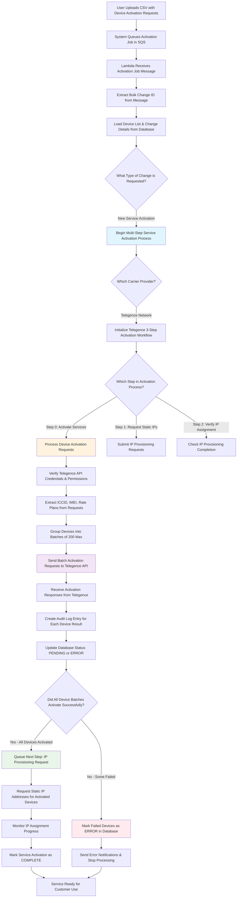

# Activate New Service Data Flow Analysis - DeviceBulkChange Repository

## 📊 Overview

This document provides a comprehensive analysis of the data flow for the "Activate New Service" functionality in the `AltaworxDeviceBulkChange.cs` lambda function, including complete code evidence and step-by-step tracing.

## 🔄 Complete Data Flow Diagram



---

## 📋 Step-by-Step Data Flow with Code Evidence

### **Step 1: Receive Activation Job from Queue**
**Code Location**: Lines 138-145
```csharp
public async Task FunctionHandler(SQSEvent sqsEvent, ILambdaContext context)
{
    KeySysLambdaContext keysysContext = null;
    this.bulkChangeRepository = new BulkChangeRepository();
    long bulkChangeId = 0;
    try
    {
        keysysContext = BaseFunctionHandler(context);
        // Processing logic starts here
    }
}
```

**Business Context**: The lambda function awakens when a new service activation job arrives in the SQS queue. This job was created when a user uploaded a CSV file containing device activation requests through the portal. The message contains metadata about which bulk change operation to process and initializes the repository connections needed to access device data.

---

### **Step 2: Identify Operation Type & Load Device Data**
**Code Location**: Lines 204-212, 475-481
```csharp
private async Task<long> ProcessEventAsync(KeySysLambdaContext context, SQSEvent sqsEvent)
{
    LogInfo(context, LogTypeConstant.Sub, "ProcessEventAsync");
    if (sqsEvent.Records.Count > 0)
    {
        if (sqsEvent.Records.Count == 1)
        {
            return await ProcessEventRecordAsync(context, sqsEvent.Records[0]);
        }
    }
}

// Routing based on change request type
switch (bulkChange.ChangeRequestType.ToLowerInvariant())
{
    case ChangeRequestType.StatusUpdate:
        var changes = GetDeviceChanges(context, bulkChange.Id, bulkChange.PortalTypeId, PageSize).ToList();
        return await ProcessStatusUpdateAsync(context, logRepo, bulkChange, changes, retryNumber);
    case ChangeRequestType.ActivateNewService:
        return await ProcessNewServiceActivationAsync(context, logRepo, bulkChange, message, additionBulkChangeId, retryNumber);
    // ... other cases
}
```

**Business Context**: The system examines the SQS message to extract the bulk change ID, then queries the database to understand what type of operation was requested. It loads the bulk change record which contains metadata like the service provider, portal type (M2M vs Mobility), and change type. Based on this information, it routes to the appropriate processing workflow - in this case, "ActivateNewService" which handles new device activations.

---

### **Step 3: Determine Carrier Network Provider**
**Code Location**: Lines 2639-2654
```csharp
private async Task<bool> ProcessNewServiceActivationAsync(KeySysLambdaContext context, DeviceBulkChangeLogRepository logRepo,
    BulkChange bulkChange, SQSEvent.SQSMessage message, long additionBulkChangeId, int retryNumber)
{
    LogInfo(context, LogTypeConstant.Sub, "ProcessNewServiceActivationAsync()");
    LogInfo(context, LogTypeConstant.Info, $"Bulk Change Id: {bulkChange.Id}");

    switch (bulkChange.IntegrationId)
    {
        case (int)IntegrationType.Telegence:
            return await ProcessTelegenceNewServiceActivationStepsAsync(context, logRepo, bulkChange, message, additionBulkChangeId, retryNumber);
        default:
            throw new Exception($"Error Activating New Service {bulkChange.Id}: Integration Type {bulkChange.Id} is unsupported.");
    }
}
```

**Business Context**: The system determines which carrier network provider will handle the device activations by checking the IntegrationId from the bulk change record. Different carriers (Telegence, Jasper, ThingSpace, etc.) have different APIs and activation procedures. Currently, only Telegence network activations are supported for new service activation. This routing ensures the correct carrier-specific activation workflow is executed.

---

### **Step 4: Execute Telegence 3-Phase Activation Workflow**
**Code Location**: Lines 2655-2687
```csharp
private async Task<bool> ProcessTelegenceNewServiceActivationStepsAsync(KeySysLambdaContext context, DeviceBulkChangeLogRepository logRepo,
    BulkChange bulkChange, SQSEvent.SQSMessage message, long additionBulkChangeId, int retryNumber)
{
    LogInfo(context, LogTypeConstant.Sub, "Start Process Telegence New Service Activation Steps Async");

    long processStep = 0;

    if (message.MessageAttributes.ContainsKey("TelegenceNewServiceActivationStep") && !string.IsNullOrWhiteSpace(message.MessageAttributes["TelegenceNewServiceActivationStep"].StringValue))
    {
        processStep = long.Parse(message.MessageAttributes["TelegenceNewServiceActivationStep"].StringValue);
    }
    LogInfo(context, LogTypeConstant.Info, $"Telegence New Activation Step: {processStep}");

    switch (processStep)
    {
        case (int)TelegenceNewActivationStep.ActivateDevice:
            var changes = GetDeviceChanges(context, bulkChange.Id, bulkChange.PortalTypeId, PageSize);

            if (changes == null || changes.Count == 0)
            {
                LogInfo(context, LogTypeConstant.Warning, $"No unprocessed changes found for new service activation {bulkChange.Id}");
                return true;
            }

            return await ProcessTelegenceNewServiceActivationsAsync(context, logRepo, bulkChange, changes, additionBulkChangeId, retryNumber);
        case (int)TelegenceNewActivationStep.RequestIPProvision:
            return await ProcessTelegenceStaticIPProvisioning(context, bulkChange, message);
        case (int)TelegenceNewActivationStep.CheckIPProvisionStatus:
            return await ProcessTelegenceCheckIPProvision(context, bulkChange, message);
        default:
            throw new Exception($"Error Activating New Service {bulkChange.Id}: Integration Type {bulkChange.IntegrationId} is unsupported.");
    }
}
```

**Business Context**: Telegence requires a 3-phase activation process for new cellular services. The system tracks which phase is currently executing via SQS message attributes:
- **Phase 0**: Activate the cellular service on devices (SIM cards become active on the network)
- **Phase 1**: Request static IP addresses for devices that need them (enterprise customers often require fixed IPs)
- **Phase 2**: Verify that IP addresses were successfully assigned and the service is fully operational

Each phase is processed as a separate Lambda invocation, allowing for resilient processing if any phase fails or times out.

---

### **Step 5: Validate Carrier API Access & Permissions**
**Code Location**: Lines 3009-3080
```csharp
private async Task<bool> ProcessTelegenceNewServiceActivationsAsync(KeySysLambdaContext context,
    DeviceBulkChangeLogRepository logRepo, BulkChange bulkChange, ICollection<BulkChangeDetailRecord> changes, long additionBulkChangeId, int retryNumber)
{
    var serviceProviderId = bulkChange.ServiceProviderId;
    LogInfo(context, LogTypeConstant.Info, $"Telegence: Processing New Service Activation for Service Provider: {serviceProviderId}");
    var telegenceApiAuthentication = GetTelegenceApiAuthentication(context.CentralDbConnectionString, serviceProviderId);

    // Pre-flight checks
    if (telegenceApiAuthentication == null)
    {
        var errorMessage = $"Unable to get Telegence API Authentication for Service Provider: {serviceProviderId}";
        LogInfo(context, LogTypeConstant.Error, errorMessage);
        await MarkProcessedForNewServiceActivationAsync(context, bulkChange.Id, false, errorMessage, null);
        return false;
    }

    if (!telegenceApiAuthentication.WriteIsEnabled)
    {
        var errorMessage = $"Write is disabled for Service Provider: {serviceProviderId}";
        LogInfo(context, LogTypeConstant.Error, errorMessage);
        await MarkProcessedForNewServiceActivationAsync(context, bulkChange.Id, false, errorMessage, null);
        return false;
    }
}
```

**Business Context**: Before attempting to activate any devices, the system performs critical security and permission checks. It retrieves the Telegence API credentials specific to the service provider (each customer may have different Telegence accounts), validates that the credentials exist and are properly configured, and verifies that write operations are enabled (some accounts may be read-only for security). If any of these checks fail, all device activations in the batch are immediately marked as ERROR to prevent partial processing.

---

### **Step 6: Extract Device Details & Service Parameters**
**Code Location**: Lines 3081-3095
```csharp
var telegenceActivationListItems = new List<TelegenceActivationRequest>();
var carrierDataGroup = string.Empty;
var carrierRatePool = string.Empty;
foreach (var change in changes)
{
    LogInfo(context, LogTypeConstant.Info, $"Processing Change: {change.Id} with change request: {change.ChangeRequest}");
    var telegenceChangeRequest = JsonConvert.DeserializeObject<TelegenceActivationChangeRequest>(change.ChangeRequest);

    telegenceActivationListItems.Add(telegenceChangeRequest.TelegenceActivationRequest);
    carrierDataGroup = telegenceChangeRequest.CarrierDataGroup;
    carrierRatePool = telegenceChangeRequest.CarrierRatePool;
}
```

**Business Context**: The system processes each device activation request from the user's CSV upload. For each device, it extracts critical information including:
- **ICCID**: SIM card identifier that uniquely identifies each cellular device
- **IMEI**: Device hardware identifier for the cellular modem
- **Rate Plan**: Data plan configuration (unlimited, tiered, etc.)
- **Service Characteristics**: Additional settings like APN, data groups, billing accounts
- **Carrier Data Group & Rate Pool**: Network routing and billing pool assignments

This information is parsed from JSON stored in the database and prepared for the Telegence API format.

---

### **Step 7: Submit Device Activations to Telegence Network**
**Code Location**: Lines 3096-3150
```csharp
var isAllBatchesSuccess = true;
var activationListInBatches = telegenceActivationListItems.SplitCollection(MAX_TELEGENCE_SERVICES_PER_REQUEST);
int index = 0;

foreach (var telegenceActivationList in activationListInBatches)
{
    LogInfo(context, CommonConstants.INFO, $"Processing batch {index} of {activationListInBatches.Count()}");
    var httpRetryPolicy = GetHttpRetryPolicy(context);

    // Filter remove ServiceCharacteristic ("remove offering code")
    var tlActivationListSliceRemoveOfferingCode = telegenceActivationList.Select(t => new TelegenceActivationRequest()
    {
        BillingAccount = t.BillingAccount,
        RelatedParty = t.RelatedParty,
        Service = new Amop.Core.Models.Telegence.Api.Service()
        {
            Category = t.Service.Category,
            Error = t.Service.Error,
            Name = t.Service.Name,
            ServiceSpecification = t.Service.ServiceSpecification,
            ServiceCharacteristic = t.Service.ServiceCharacteristic.Where(t => !t.Name.Equals(Common.CommonString.REMOVE_SOC_CODE_STRING)).ToList(),
            Status = t.Service.Status,
            SubscriberNumber = t.Service.SubscriberNumber,
            ServiceQualification = t.Service.ServiceQualification
        }
    }).ToList();

    await httpRetryPolicy.ExecuteAsync(async () =>
    {
        apiResult = await _telegenceApiPostClient.ActivateDevicesAsync(tlActivationListSliceRemoveOfferingCode, TelegenceDeviceStatusUpdateURL, httpClient);
    });
}
```

**Business Context**: The system now sends activation requests to the Telegence cellular network. Due to API limitations, it processes devices in batches of up to 200 per request. For each batch:
- **Batch Creation**: Groups devices to respect Telegence's API limits and prevent timeouts
- **Service Code Filtering**: Removes certain internal offering codes that shouldn't be sent to Telegence
- **Network Activation**: Sends HTTPS requests to Telegence API endpoints that actually provision the SIM cards on the cellular network
- **Retry Handling**: If network calls fail due to temporary issues, the system automatically retries with exponential backoff

Each API call instructs Telegence to activate the cellular service for the specified SIM cards, making them accessible on the mobile network.

---

### **Step 8: Process Carrier Response & Create Audit Trail**
**Code Location**: Lines 3151-3180
```csharp
var isSuccessful = !apiResult?.HasErrors ?? false;
if (!isSuccessful)
{
    isAllBatchesSuccess = false;
    LogVariableValue(context, nameof(apiResult.ResponseObject.ErrorMessage), apiResult.ResponseObject.ErrorMessage);
}

// Logging into each change based on iccid
foreach (var requestedDevice in telegenceActivationList)
{
    var iccid = requestedDevice.Service.ServiceCharacteristic.FirstOrDefault(sc => sc.Name == "sim")?.Value;

    // Create bulkchange log activate new service 
    logRepo.AddMobilityLogEntry(new CreateMobilityDeviceBulkChangeLog()
    {
        BulkChangeId = bulkChange.Id,
        ErrorText = apiResult.HasErrors ? JsonConvert.SerializeObject(apiResult.ResponseObject.TelegenceActivationResponse) : null,
        HasErrors = apiResult.HasErrors,
        LogEntryDescription = "Telegence New Service Activation: Telegence API",
        MobilityDeviceChangeId = (long)(changes.FirstOrDefault(ch => ch.ICCID == iccid)?.Id),
        ProcessBy = "AltaworxDeviceBulkChange",
        ProcessedDate = DateTime.UtcNow,
        ResponseStatus = isSuccessful ? BulkChangeStatus.PENDING : BulkChangeStatus.ERROR,
        RequestText = apiResult.ActionText + Environment.NewLine + JsonConvert.SerializeObject(apiResult.RequestObject),
        ResponseText = apiResult.ResponseObject != null ? JsonConvert.SerializeObject(apiResult.ResponseObject) : string.Empty
    });
}
```

**Business Context**: After receiving responses from Telegence, the system creates a comprehensive audit trail for compliance and troubleshooting. For each individual device:
- **Success Tracking**: Determines if the activation was successful or failed based on Telegence's response
- **Individual Device Logging**: Creates a separate log record for each ICCID, even within batch operations
- **Status Assignment**: Sets device status to PENDING (activation in progress) or ERROR (activation failed)
- **Detailed Audit Records**: Captures the complete request sent to Telegence and the full response received
- **Compliance Documentation**: Stores timestamps, process information, and error details for regulatory requirements

This granular logging allows customer service teams to troubleshoot individual device issues and provides audit trails for billing and compliance purposes.

---

### **Step 9: Update Device Status in System Database**
**Code Location**: Lines 3181-3199, 5662-5685
```csharp
// Mark changes as processed/error
await MarkProcessedForNewServiceActivationAsync(context, bulkChange.Id, isSuccessful, activationResponse, iccidList, serviceProviderId, userName);

// Implementation of MarkProcessedForNewServiceActivationAsync
public static async Task MarkProcessedForNewServiceActivationAsync(KeySysLambdaContext context, long bulkChangeId, bool apiResult, string statusDetails, List<string> iccidList, int? serviceProviderId = null, string userName = "")
{
    var policyFactory = new PolicyFactory(context.logger);
    var sqlRetryPolicy = policyFactory.GetSqlRetryPolicy(CommonConstants.NUMBER_OF_RETRIES);
    var parameters = new List<SqlParameter>()
    {
        new SqlParameter(CommonSQLParameterNames.BULK_CHANGE_ID_PASCAL_CASE, bulkChangeId),
        new SqlParameter(CommonSQLParameterNames.API_CALL_RESULT_PASCAL_CASE, apiResult ? 1 : 0),
        new SqlParameter(CommonSQLParameterNames.STATUS_DETAILS_PASCAL_CASE, statusDetails),
        new SqlParameter(CommonSQLParameterNames.ICCID_LIST, iccidList != null ? string.Join(',', iccidList) : null),
    };
    
    sqlRetryPolicy.Execute(() =>
         Amop.Core.Helpers.SqlQueryHelper.ExecuteStoredProcedureWithRowCountResult(ParameterizedLog(context),
            context.CentralDbConnectionString,
            Amop.Core.Constants.SQLConstant.StoredProcedureName.DEVICE_BULK_CHANGE_NEW_SERVICE_ACTIVATION_UPDATE_MOBILITY_CHANGE,
            parameters,
            Amop.Core.Constants.SQLConstant.ShortTimeoutSeconds));
}
```

**Business Context**: The system updates its internal device management database to reflect the current activation status. This critical step ensures that:
- **Device Status Synchronization**: Internal records match the actual status on the Telegence network
- **Customer Portal Updates**: Users can see real-time progress of their activation requests
- **Billing System Integration**: Devices marked as PENDING will begin generating usage charges once fully activated
- **Workflow Progression**: Successfully activated devices are prepared for the next phase (IP provisioning)
- **Error Tracking**: Failed devices are flagged for manual review and customer notification

The database update uses a dedicated stored procedure that handles multiple devices efficiently and includes retry logic for database connectivity issues.

---

### **Step 10: Schedule Next Phase or Handle Failures**
**Code Location**: Lines 3185-3190
```csharp
if (isAllBatchesSuccess)
{
    await EnqueueDeviceBulkChangesAsync(context, bulkChange.Id, DeviceBulkChangeQueueUrl, SQS_SHORT_DELAY_SECONDS, retryNumber, true,
        serviceProviderId, carrierRatePool, carrierDataGroup, 1, additionBulkChangeId);
}
else
{
    // Handle failed activations - mark related changes as error
}
```

**Business Context**: The system now determines how to proceed based on the activation results:

**If All Devices Activated Successfully:**
- **Schedule IP Provisioning**: Creates a new SQS message for Phase 1 (Static IP provisioning request)
- **Preserve Context**: Includes carrier data group and rate pool information needed for IP requests
- **Short Delay**: Uses a brief delay to allow Telegence systems to propagate the activation before requesting IPs
- **Workflow Continuation**: Ensures the 3-phase process continues seamlessly

**If Any Devices Failed:**
- **Stop Processing**: Prevents IP provisioning attempts for failed devices
- **Error Propagation**: Marks related bulk changes (like customer assignments) as ERROR
- **Failure Isolation**: Ensures partial failures don't corrupt the overall activation workflow
- **Customer Notification**: Failed activations trigger alerts for manual intervention

This decision point is critical for maintaining data integrity and preventing billing issues from partially completed activations.

---

## 🔧 Key Configuration Constants

**Code Location**: Lines 80-95
```csharp
private const int THINGSPACE_DEVICESTATUS_PENDINGACTIVATION = 15;
private const int THINGSPACE_DEVICESTATUSID_ACTIVE = 8;
private const int MAX_DEVICE_CHANGES = Int32.MaxValue;
private const int PageSize = 100;
private const int NEW_SERVICE_ACTIVATION_MAX_COUNT = 6;
private const int MAX_TELEGENCE_SERVICES_PER_REQUEST = 200;
private readonly string MAX_PARALLEL_REQUEST = Environment.GetEnvironmentVariable(EnvironmentVariableKeyConstants.MAX_PARALLEL_REQUESTS) ?? "10";
```

---

## 📊 Data Flow Through Repository Systems

### **Device Management Database Operations**
```csharp
// Initialize repository
this.bulkChangeRepository = new BulkChangeRepository();

// Get device changes for processing
var changes = GetDeviceChanges(context, bulkChange.Id, bulkChange.PortalTypeId, PageSize);

// Update bulk change status
await bulkChangeRepository.MarkBulkChangeStatusAsync(context, bulkChange.Id, BulkChangeStatus.PROCESSED);
```

**Business Context**: The BulkChangeRepository manages the overall activation workflow status and retrieves device lists that customers uploaded via CSV. It tracks whether entire bulk operations are "PROCESSING", "PROCESSED", or "ERROR" status, providing customers with high-level progress visibility on their activation requests.

### **Audit Trail & Compliance Logging**
```csharp
// Create detailed logs for each device activation
logRepo.AddMobilityLogEntry(new CreateMobilityDeviceBulkChangeLog()
{
    BulkChangeId = bulkChange.Id,
    ErrorText = apiResult.HasErrors ? JsonConvert.SerializeObject(apiResult.ResponseObject.TelegenceActivationResponse) : null,
    HasErrors = apiResult.HasErrors,
    LogEntryDescription = "Telegence New Service Activation: Telegence API",
    MobilityDeviceChangeId = (long)(changes.FirstOrDefault(ch => ch.ICCID == iccid)?.Id),
    ProcessBy = "AltaworxDeviceBulkChange",
    ProcessedDate = DateTime.UtcNow,
    ResponseStatus = isSuccessful ? BulkChangeStatus.PENDING : BulkChangeStatus.ERROR,
    RequestText = apiResult.ActionText + Environment.NewLine + JsonConvert.SerializeObject(apiResult.RequestObject),
    ResponseText = apiResult.ResponseObject != null ? JsonConvert.SerializeObject(apiResult.ResponseObject) : string.Empty
});
```

**Business Context**: The DeviceBulkChangeLogRepository creates immutable audit records for every carrier API interaction. These logs serve multiple business purposes:
- **Regulatory Compliance**: Maintains detailed records of all activation attempts for telecom audits
- **Customer Support**: Enables support teams to troubleshoot specific device activation failures
- **Billing Validation**: Provides evidence of successful activations for billing disputes
- **SLA Monitoring**: Tracks carrier API performance and response times for service level agreements

---

## 🚨 Business Continuity & Error Recovery

### **Authentication & Security Failures**
**Business Impact**: When API credentials are invalid or write permissions are disabled, the system immediately stops all processing to prevent:
- **Billing Errors**: Avoiding partial activations that could cause incorrect charges
- **Security Breaches**: Preventing unauthorized access to carrier networks
- **Customer Confusion**: Ensuring clear error messages about permission issues
- **SLA Violations**: Failing fast rather than creating timeout delays

### **Carrier Network Communication Issues**
**Business Impact**: When Telegence API calls fail due to network issues or temporary outages:
- **Automatic Recovery**: Retry policies handle transient network problems without human intervention
- **Batch Isolation**: Failed batches don't affect successful ones, maximizing completed activations
- **Detailed Diagnostics**: Complete request/response logging enables rapid problem resolution
- **Customer Transparency**: Granular error tracking allows specific failure explanations to customers

### **Scale & Performance Protection**
**Business Impact**: Batch processing and limits protect both systems and business operations:
- **Carrier Relationship**: Respecting API limits prevents being blocked by Telegence
- **Resource Management**: Batch sizes prevent Lambda timeouts and memory issues
- **All-or-Nothing Safety**: Requiring complete batch success prevents partial billing scenarios
- **Operational Efficiency**: Failed batches trigger immediate escalation rather than continuing wasteful processing

---

## 🔄 Multi-Phase Business Workflow

1. **Phase 0 - Service Activation**: Provisions cellular service on the Telegence network, making SIM cards active and able to connect to cellular towers. This is the core activation that enables basic connectivity.

2. **Phase 1 - IP Address Provisioning**: For enterprise customers requiring static IP addresses, requests dedicated IP allocations from Telegence's IP pool. Critical for VPN connectivity and firewall configurations.

3. **Phase 2 - Service Verification**: Confirms that both cellular service and IP addresses are properly assigned and functional, ensuring complete service readiness before customer notification.

Each phase operates as an independent workflow stage with separate SQS messages, enabling resilient processing where individual phases can be retried without affecting completed work.

---

## 📈 Operational Scale & Performance

**Business Volume Handling:**
- **Enterprise Scale**: Processes up to 200 device activations per API call to handle large corporate deployments efficiently
- **Retry Resilience**: Automatic retry logic handles temporary network issues without manual intervention, maintaining high success rates
- **Resource Optimization**: Lambda timeout monitoring prevents failed operations from consuming excessive cloud resources
- **Concurrent Processing**: Configurable parallel processing limits balance speed with carrier API rate limits
- **Memory Efficiency**: Paginated batch processing enables handling thousands of devices without memory constraints

**Customer Experience Benefits:**
- **Fast Processing**: Bulk operations complete in minutes rather than hours through optimized batching
- **Reliable Delivery**: Multi-phase approach with independent retry capabilities ensures high completion rates
- **Transparent Progress**: Detailed status tracking allows customers to monitor activation progress in real-time
- **Error Isolation**: Individual device failures don't impact other devices in the same bulk operation

This enterprise-grade architecture ensures reliable, scalable cellular service activation that meets the demands of large-scale IoT deployments while maintaining operational excellence and customer satisfaction.