# AltaworxDeviceBulkChange Lambda - Contextual Data Flow Diagram

## 📊 Main Data Flow - Contextual View

```mermaid
graph TD
    A[User Uploads Bulk Change File] --> B[Message Queued for Processing]
    B --> C[Lambda Receives Processing Request]
    C --> D[Route Request by Change Type]
    D --> E[Handle Device Status Updates]
    E --> F[Process Telegence Provider Changes]
    F --> G[Prepare Subscriber Update Request]
    
    G --> H[Build API Request Payload]
    H --> I{Check Device Compatibility}
    I -->|eSIM Only Device| J[Send Physical SIM Data to Provider]
    I -->|Physical SIM Device| J
    
    J --> K[Provider Processes Request]
    K --> L{Analyze Provider Response}
    
    L -->|Operation Successful| M[Record Success in Logs]
    L -->|eSIM Compatibility Issue| N[Receive Ambiguous Error Message]
    L -->|Standard Error| O[Receive Clear Error Message]
    
    N --> P[❌ PROBLEM: Record as Generic Failure]
    O --> Q[Record Specific Error Details]
    M --> R[Update Device Status in Database]
    
    P --> S[❌ User Sees Confusing Error]
    Q --> T[User Sees Clear Error Message]
    R --> U[✅ Change Successfully Applied]
    
    style N fill:#ffcccc
    style P fill:#ffcccc
    style S fill:#ffcccc
    style I fill:#fff2cc
    style K fill:#e1f5fe
```



---

## 🔍 Detailed Process Flow - Business Context

```mermaid
graph TD
    %% User Actions
    USER[Administrator/User]
    
    %% System Components
    PORTAL[Admin Portal/UI]
    QUEUE[Message Queue System]
    LAMBDA[Bulk Change Processor]
    
    %% External Services
    TEL_API[Telegence Provider API]
    REV_API[Revenue Service API]
    
    %% Data Storage
    DB[(System Database)]
    LOGS[(Audit Logs)]
    
    %% Process Flow
    USER -->|Uploads CSV File| PORTAL
    PORTAL -->|Creates Bulk Change Job| QUEUE
    QUEUE -->|Triggers Processing| LAMBDA
    
    %% Lambda Internal Flow
    LAMBDA --> P1[Receive Processing Request]
    P1 --> P2[Validate Request Data]
    P2 --> P3[Determine Change Type]
    P3 --> P4[Route to Appropriate Handler]
    P4 --> P5[Authenticate with Provider]
    P5 --> P6[Build Service Request]
    
    %% API Interaction
    P6 --> P7[Send Request to Provider]
    P7 --> TEL_API
    TEL_API --> P8[Receive Provider Response]
    
    %% Response Processing
    P8 --> D1{Response Status}
    D1 -->|Success| P9[Process Successful Response]
    D1 -->|eSIM Error| P10[Handle Vague Error Response]
    D1 -->|Clear Error| P11[Process Standard Error]
    
    %% Logging and Status Updates
    P9 --> P12[Create Success Log Entry]
    P10 --> P13[❌ Create Generic Error Log]
    P11 --> P14[Create Specific Error Log]
    
    P12 --> LOGS
    P13 --> LOGS
    P14 --> LOGS
    
    %% Database Updates
    P9 --> P15[Update Device Status]
    P10 --> P16[Mark as Failed - Generic]
    P11 --> P17[Mark as Failed - Specific]
    
    P15 --> DB
    P16 --> DB
    P17 --> DB
    
    %% Revenue Service Creation
    P9 --> P18[Create Revenue Service]
    P18 --> REV_API
    REV_API --> P19[Update Service Records]
    P19 --> DB
    
    %% User Feedback
    P12 --> SUCCESS[✅ Success Notification]
    P13 --> ERROR1[❌ Generic Error Message]
    P14 --> ERROR2[✅ Clear Error Message]
    
    SUCCESS --> PORTAL
    ERROR1 --> PORTAL
    ERROR2 --> PORTAL
    
    %% Problem Highlighting
    style P10 fill:#ffcccc
    style P13 fill:#ffcccc
    style P16 fill:#ffcccc
    style ERROR1 fill:#ffcccc
    style D1 fill:#fff2cc
    style TEL_API fill:#e1f5fe
```



---

## 📋 Process Descriptions (Business Context)

### **Core Processing Pipeline**

| **Process** | **Business Function** | **Current Behavior** | **Issue** |
|-------------|----------------------|---------------------|-----------|
| **Receive Processing Request** | Accept bulk change job from queue | ✅ Works correctly | None |
| **Validate Request Data** | Check message format and bulk change ID | ✅ Works correctly | None |
| **Determine Change Type** | Identify operation type (status update, activation, etc.) | ✅ Works correctly | None |
| **Route to Appropriate Handler** | Direct to carrier-specific processor | ✅ Routes to Telegence | None |
| **Authenticate with Provider** | Get API credentials and validate access | ✅ Works correctly | None |
| **Build Service Request** | Create API payload with device data | ✅ Builds request | None |
| **Send Request to Provider** | Make HTTP call to Telegence API | ✅ Sends request | None |
| **Receive Provider Response** | Get API response from Telegence | ✅ Receives response | None |
| **Handle Response Status** | Interpret API response | ❌ **PROBLEM HERE** | Generic interpretation |
| **Process Error Response** | Handle eSIM-related failures | ❌ **MAJOR ISSUE** | Doesn't detect eSIM errors |
| **Create Error Log Entry** | Record failure details | ❌ **PROBLEM** | Logs as "NotFound" |
| **Update Device Status** | Mark device as processed/failed | ❌ **ISSUE** | Generic failure status |

---

## 🎯 Critical Decision Points

### **Device Compatibility Check** 

```mermaid
graph TD
    INPUT[Device Change Request]
    INPUT --> CHECK{Evaluate Device Type}
    CHECK -->|eSIM Compatible Device| PATH1[Process with eSIM Logic]
    CHECK -->|Physical SIM Only| PATH2[Process with Physical SIM]
    CHECK -->|Unknown/Mixed| PATH3[Use Default Processing]
    
    PATH1 --> RESULT1[Appropriate Handling]
    PATH2 --> RESULT2[Standard Processing]
    PATH3 --> RESULT3[❌ May Cause eSIM Issues]
    
    style CHECK fill:#fff2cc
    style RESULT3 fill:#ffcccc
```


### **Response Interpretation Logic**

```mermaid
graph TD
    RESPONSE[Provider API Response]
    RESPONSE --> ANALYZE{Analyze Response Content}
    
    ANALYZE -->|HTTP 200 + Valid Data| SUCCESS[Success Path]
    ANALYZE -->|HTTP Error + Clear Message| CLEAR_ERROR[Standard Error Path]
    ANALYZE -->|HTTP 200 + Vague Message| VAGUE_ERROR[❌ eSIM Error Path]
    
    SUCCESS --> LOG_SUCCESS[Log: Operation Successful]
    CLEAR_ERROR --> LOG_CLEAR[Log: Specific Error Message]
    VAGUE_ERROR --> LOG_VAGUE[❌ Log: Generic 'NotFound']
    
    style ANALYZE fill:#fff2cc
    style VAGUE_ERROR fill:#ffcccc
    style LOG_VAGUE fill:#ffcccc
```


---

## 🔄 Data Transformation Flow

### **Current Problem Flow:**
```
User Request → Physical SIM Data → Provider API → Vague Response → Generic Log → User Confusion
```

### **Desired Enhanced Flow:**
```
User Request → Device Type Check → Smart API Call → Intelligent Response Parsing → Clear Error Message → User Understanding
```

---

## 📊 System Interactions

### **External Entity Interactions**

| **Entity** | **Data In** | **Data Out** | **Purpose** |
|------------|-------------|--------------|-------------|
| **Admin Portal** | Bulk change files, user actions | Status updates, error messages | User interface |
| **Message Queue** | Processing triggers | Job completion status | Async processing |
| **Telegence API** | Device update requests | Operation responses | Provider integration |
| **Revenue API** | Service creation requests | Service confirmations | Billing integration |
| **System Database** | Status updates, configurations | Device data, settings | Data persistence |
| **Audit Logs** | Operation logs, errors | Historical data | Compliance & debugging |

---

## 🚨 Problem Area Analysis

### **Information Loss Points:**

1. **Device Type Context Loss**
   - Input: Device with eSIM requirement
   - Process: Generic handling without type awareness
   - Output: Failed operation without context

2. **Response Interpretation Failure**
   - Input: Vague API response `{"description": "/service/"}`
   - Process: Generic error categorization
   - Output: Meaningless "NotFound" status

3. **Error Message Translation Gap**
   - Input: Provider-specific error patterns
   - Process: No intelligent error mapping
   - Output: Technical errors instead of user-friendly messages

---

## 💡 Enhancement Opportunities

### **Smart Device Processing**
- Pre-validate device compatibility before API calls
- Route eSIM devices through specialized handling logic
- Prevent inappropriate physical SIM assignments

### **Intelligent Response Processing**
- Implement response pattern recognition
- Map provider-specific errors to user-friendly messages
- Maintain error context throughout processing pipeline

### **Enhanced User Experience**
- Provide actionable error messages
- Include guidance for resolving eSIM-related issues
- Match manual portal error messaging standards

This contextual DFD focuses on the business processes and user experience rather than technical implementation details, making it easier to understand the functional flow and identify improvement opportunities.