# AltaworxDeviceBulkChange Lambda - Data Flow Diagram (DFD)

## 📊 Complete Lambda Data Flow Diagram

### Level 0 - Context Diagram


---

## 📋 Level 1 - Detailed Process Breakdown


---

## 🔍 Level 2 - Detailed UpdateTelegenceSubscriberAsync Flow

```mermaid
graph TD
    %% Input
    INPUT[Input: TelegenceSubscriberUpdateRequest]
    
    %% Processes
    P1((1. Validate Auth))
    P2((2. Build HTTP Client))
    P3((3. Check Proxy Config))
    P4((4. Prepare Request))
    P5((5. Execute API Call))
    P6((6. Process Response))
    P7((7. Log Result))
    P8((8. Return DeviceChangeResult))
    
    %% Decision Points
    D1{Write Enabled?}
    D2{Use Proxy?}
    D3{API Success?}
    D4{Response Valid?}
    
    %% Data Stores
    AUTH[(Authentication Config)]
    LOG_DB[(DeviceBulkChangeLog)]
    
    %% External APIs
    TEL_API[Telegence API]
    PROXY[Proxy Service]
    
    %% Flow
    INPUT --> P1
    P1 --> AUTH
    AUTH --> D1
    D1 -->|Yes| P2
    D1 -->|No| P7
    
    P2 --> P3
    P3 --> D2
    D2 -->|Yes| PROXY
    D2 -->|No| TEL_API
    
    P3 --> P4
    P4 --> P5
    P5 --> D3
    
    %% API Paths
    PROXY -->|Proxy Call| TEL_API
    TEL_API -->|Direct Call| P6
    PROXY -->|Proxy Response| P6
    
    %% Response Processing
    D3 -->|Success| D4
    D3 -->|Failure| P7
    D4 -->|Valid| P7
    D4 -->|Invalid/eSIM Error| P7
    
    P6 --> P7
    P7 --> LOG_DB
    P7 --> P8
    
    %% Problem Area Highlighting
    style D4 fill:#ffcdd2
    style P6 fill:#ffcdd2
    style P7 fill:#fff3e0
    
    %% Annotations
    P6 -.->|❌ ISSUE: Generic parsing| NOTE1[Does not detect eSIM errors]
    P7 -.->|❌ ISSUE: Vague logging| NOTE2[Logs as 'NotFound']
    
    style NOTE1 fill:#ffebee
    style NOTE2 fill:#ffebee
```



---

## 📊 Traditional DFD Notation

### **Data Flow Diagram Components**

| Symbol | Meaning | Examples in Lambda |
|--------|---------|-------------------|
| ⭕ **Circle** | Process | `1. Function Handler`, `2. Process Event` |
| **Rectangle** | External Entity | `SQS Queue`, `Telegence API`, `User Portal` |
| **Open Rectangle** | Data Store | `BulkChange Table`, `DeviceBulkChangeLog` |
| **Arrow** | Data Flow | `SQS Message`, `API Request`, `Log Entry` |

---

## 🗂️ Detailed Process Dictionary

### **Process 1: Function Handler**
- **Input**: SQS Event from queue
- **Output**: Processed bulk change ID
- **Function**: Entry point, initializes context and routes to event processor
- **Location**: `Line 138 - FunctionHandler()`

### **Process 2: Process Event** 
- **Input**: Bulk change ID from SQS message
- **Output**: Event processing result
- **Function**: Validates message, retrieves bulk change data
- **Location**: `Line 218 - ProcessEventRecordAsync()`

### **Process 3: Route by Change Type**
- **Input**: Bulk change object with change type
- **Output**: Routing to specific processor
- **Function**: Switch statement routing based on change request type
- **Location**: `Line 456 - ProcessBulkChangeAsync()`

### **Process 4: Process Status Update**
- **Input**: Status update changes collection
- **Output**: Processing results
- **Function**: Routes to carrier-specific processors
- **Location**: `Line 2527 - ProcessStatusUpdateAsync()`

### **Process 5: Process Telegence Update**
- **Input**: Telegence-specific changes
- **Output**: API call results
- **Function**: Handles Telegence authentication and API orchestration
- **Location**: `Line 2883 - ProcessTelegenceStatusUpdateAsync()`

### **Process 6: Update Subscriber API** ⚠️ **PROBLEM AREA**
- **Input**: TelegenceSubscriberUpdateRequest
- **Output**: DeviceChangeResult with API response
- **Function**: Makes HTTP calls to Telegence API
- **Location**: `Line 6047 - UpdateTelegenceSubscriberAsync()`
- **ISSUE**: Generic error handling, doesn't detect eSIM errors

### **Process 7: Log Operations**
- **Input**: API results and error information
- **Output**: Database log entries
- **Function**: Creates log entries in DeviceBulkChangeLog table
- **ISSUE**: Logs vague errors without interpretation

### **Process 8: Update Status**
- **Input**: Processing results
- **Output**: Updated device/bulk change status
- **Function**: Marks changes as processed/error in database

### **Process 9: Create Rev Service**
- **Input**: Service creation requests
- **Output**: Rev.io API responses
- **Function**: Creates revenue services via Rev.io API

---

## 🔥 Critical Data Flows (Problem Areas)

### **Flow: API Response Processing**
```
Telegence API → Process 6 → Process 7 → Database Log
     ↓              ↓           ↓            ↓
Vague Response → Generic Parse → "NotFound" → User Confusion
```

### **Current Problem Flow:**
1. **Telegence API** returns: `{"id": "xxx", "description": "/service/"}`
2. **Process 6** interprets as: Generic failure
3. **Process 7** logs as: `Status: NotFound`
4. **User sees**: Confusing error message

### **Desired Flow:**
1. **Telegence API** returns: `{"id": "xxx", "description": "/service/"}`
2. **Enhanced Process 6** interprets as: eSIM requirement detected
3. **Enhanced Process 7** logs as: `Status: Device requires eSIM`
4. **User sees**: Clear, actionable error message

---

## 📋 Data Store Details

### **DS1: BulkChange Table**
- **Contains**: Bulk change metadata, status, service provider info
- **Read by**: Process 2, Process 3
- **Written by**: Process 8
- **Key fields**: Id, ChangeRequestType, IntegrationId, Status

### **DS2: DeviceBulkChangeLog**
- **Contains**: Detailed operation logs, API requests/responses
- **Read by**: Reporting systems
- **Written by**: Process 7
- **Key fields**: LogEntryDescription, RequestText, ResponseText, HasErrors

### **DS3: Device Table**
- **Contains**: Device information, ICCID, IMEI, status
- **Read by**: Process 5, Process 6
- **Written by**: Process 8
- **Key fields**: ICCID, IMEI, DeviceStatusId, ServiceProviderId

### **DS4: Authentication Tables**
- **Contains**: API credentials for external services
- **Read by**: Process 5, Process 6, Process 9
- **Key fields**: ClientId, Password, BaseUrl, WriteIsEnabled

---

## 🎯 DFD Analysis Summary

### **Data Flow Complexity**
- **Total Processes**: 9 major processes
- **External Entities**: 5 (SQS, Telegence API, Rev.io API, Proxy, Database)
- **Data Stores**: 4 primary tables
- **Critical Path**: SQS → Process 1-6 → Telegence API → Process 7-8

### **Bottlenecks & Issues**
1. **Process 6** - Generic error handling
2. **Process 7** - Inadequate error interpretation  
3. **Data Flow** - Loss of error context between API and logging

### **Dependencies**
- **Authentication** required for all API calls
- **Proxy configuration** affects API routing
- **Database availability** critical for all operations
- **External API availability** affects success rates

This DFD provides a complete view of data flow through the lambda function, highlighting where the eSIM error handling issue occurs and what data transformations need enhancement.