# Lambda Data Flow with Code Evidence

## 📊 Main Data Flow - With Code Evidence

```mermaid
graph TD
    A[User Uploads Bulk Change File] --> B[Message Queued for Processing]
    B --> C[Lambda Receives Processing Request]
    C --> D[Route Request by Change Type]
    D --> E[Handle Device Status Updates]
    E --> F[Process Telegence Provider Changes]
    F --> G[Prepare Subscriber Update Request]
    
    G --> H[Build API Request Payload]
    H --> I{Check Device Compatibility}
    I -->|eSIM Only Device| J[Send Physical SIM Data to Provider]
    I -->|Physical SIM Device| J
    
    J --> K[Provider Processes Request]
    K --> L{Analyze Provider Response}
    
    L -->|Operation Successful| M[Record Success in Logs]
    L -->|eSIM Compatibility Issue| N[Receive Ambiguous Error Message]
    L -->|Standard Error| O[Receive Clear Error Message]
    
    N --> P[❌ PROBLEM: Record as Generic Failure]
    O --> Q[Record Specific Error Details]
    M --> R[Update Device Status in Database]
    
    P --> S[❌ User Sees Confusing Error]
    Q --> T[User Sees Clear Error Message]
    R --> U[✅ Change Successfully Applied]
    
    style N fill:#ffcccc
    style P fill:#ffcccc
    style S fill:#ffcccc
    style I fill:#fff2cc
    style K fill:#e1f5fe
```



---

## 🔍 Code Evidence for Each Step

### **A. User Uploads Bulk Change File**
**Evidence**: External to lambda, but referenced in processing
```csharp
// Referenced in logs and processing
LogInfo(context, LogTypeConstant.Info, $"Found {changes.Count} changes to process");
```

---

### **B. Message Queued for Processing**
**Code Evidence**: SQS Message handling setup
**Location**: Lines 101-115
```csharp
private string DeviceBulkChangeQueueUrl = Environment.GetEnvironmentVariable(EnvironmentVariableKeyConstants.DEVICE_BULK_CHANGE_QUEUE_URL);

// Queue URL setup in function handler
DeviceBulkChangeQueueUrl = context.ClientContext.Environment[EnvironmentVariableKeyConstants.DEVICE_BULK_CHANGE_QUEUE_URL];
```

**SQS Message Processing**: Lines 365-420
```csharp
private async Task EnqueueDeviceBulkChangesAsync(KeySysLambdaContext context, long bulkChangeId,
    string queueUrl, int delaySeconds, int retryNumber, bool newServiceActivations = false, ...)
{
    using (var client = new AmazonSQSClient(awsCredentials, RegionEndpoint.USEast1))
    {
        var request = new SendMessageRequest
        {
            DelaySeconds = delaySeconds,
            MessageAttributes = messageAttributes,
            MessageBody = "Not used",
            QueueUrl = queueUrl
        };
    }
}
```

---

### **C. Lambda Receives Processing Request**
**Code Evidence**: Main function handler
**Location**: Lines 138-145
```csharp
public async Task FunctionHandler(SQSEvent sqsEvent, ILambdaContext context)
{
    KeySysLambdaContext keysysContext = null;
    this.bulkChangeRepository = new BulkChangeRepository();
    long bulkChangeId = 0;
    try
    {
        keysysContext = BaseFunctionHandler(context);
        // ... processing logic
    }
}
```

**SQS Event Processing**: Lines 204-212
```csharp
private async Task<long> ProcessEventAsync(KeySysLambdaContext context, SQSEvent sqsEvent)
{
    LogInfo(context, LogTypeConstant.Sub, "ProcessEventAsync");
    if (sqsEvent.Records.Count > 0)
    {
        if (sqsEvent.Records.Count == 1)
        {
            return await ProcessEventRecordAsync(context, sqsEvent.Records[0]);
        }
    }
}
```

---

### **D. Route Request by Change Type**
**Code Evidence**: Change type routing switch statement
**Location**: Lines 456-520
```csharp
private async Task<bool> ProcessBulkChangeAsync(KeySysLambdaContext context, long bulkChangeId, ...)
{
    switch (bulkChange.ChangeRequestType.ToLowerInvariant())
    {
        case ChangeRequestType.StatusUpdate:
            var changes = GetDeviceChanges(context, bulkChange.Id, bulkChange.PortalTypeId, PageSize).ToList();
            return await ProcessStatusUpdateAsync(context, logRepo, bulkChange, changes, retryNumber);
        case ChangeRequestType.ActivateNewService:
            return await ProcessNewServiceActivationAsync(context, logRepo, bulkChange, message, additionBulkChangeId, retryNumber);
        case ChangeRequestType.ChangeICCIDAndIMEI:
            await ProcessChangeEquipmentAsync(context, logRepo, bulkChange);
            return true;
        // ... other cases
    }
}
```

---

### **E. Handle Device Status Updates**
**Code Evidence**: Status update processing method
**Location**: Lines 2527-2540
```csharp
private async Task<bool> ProcessStatusUpdateAsync(KeySysLambdaContext context, DeviceBulkChangeLogRepository logRepo,
    BulkChange bulkChange, ICollection<BulkChangeDetailRecord> changes, int retryNumber)
{
    var result = false;
    var revIOAuthenticationRepository = new RevioAuthenticationRepository(context.CentralDbConnectionString, new Base64Service());
    StatusUpdateRequest<dynamic> statusUpdateRequest;
    if (changes != null && changes.Count > 0)
    {
        statusUpdateRequest = JsonConvert.DeserializeObject<StatusUpdateRequest<dynamic>>(changes.FirstOrDefault()?.ChangeRequest);
    }
}
```

**Integration routing**: Lines 2558-2590
```csharp
switch (bulkChange.IntegrationId)
{
    case (int)IntegrationType.eBonding:
        await EnqueueDeviceBulkChangesAsync(context, bulkChange.Id, eBondingDeviceStatusChangeQueueUrl, SQS_SHORT_DELAY_SECONDS, retryNumber);
        break;
    case (int)IntegrationType.Telegence:
        result = await ProcessTelegenceStatusUpdateAsync(context, logRepo, bulkChange, changes,
            httpRetryPolicy, sqlRetryPolicy, revApiClient, integrationAuthenticationId);
        break;
    // ... other integrations
}
```

---

### **F. Process Telegence Provider Changes**
**Code Evidence**: Telegence-specific processing
**Location**: Lines 2883-2890
```csharp
private async Task<bool> ProcessTelegenceStatusUpdateAsync(KeySysLambdaContext context, DeviceBulkChangeLogRepository logRepo,
    BulkChange bulkChange, ICollection<BulkChangeDetailRecord> changes, IAsyncPolicy httpRetryPolicy, IAsyncPolicy sqlRetryPolicy,
    RevioApiClient revApiClient, int integrationAuthenticationId)
{
    bool allSuccessful = true;
    var telegenceAuthenticationInfo = TelegenceCommon.GetTelegenceAuthenticationInformation(context.CentralDbConnectionString, bulkChange.ServiceProviderId);
}
```

**Authentication and setup**: Lines 2892-2900
```csharp
if (telegenceAuthenticationInfo != null)
{
    if (telegenceAuthenticationInfo.WriteIsEnabled)
    {
        var telegenceAuthentication = telegenceAuthenticationInfo;
        List<TelegenceActivationRequest> telegenceActivationRequests = new List<TelegenceActivationRequest>();
        int statusId = 0;
    }
}
```

---

### **G. Prepare Subscriber Update Request**
**Code Evidence**: Request preparation in processing loop
**Location**: Lines 2910-2925
```csharp
foreach (var change in changes)
{
    var changeRequest = JsonConvert.DeserializeObject<StatusUpdateRequest<dynamic>>(change.ChangeRequest);
    if (changeRequest.UpdateStatus == "A")
    {
        var activationRequest = JsonConvert.DeserializeObject<StatusUpdateRequest<TelegenceActivationRequest>>(change.ChangeRequest).Request;
        telegenceActivationRequests.Add(activationRequest);
        statusId = changeRequest.PostUpdateStatusId;
    }
    else
    {
        var updateRequest = JsonConvert.DeserializeObject<StatusUpdateRequest<TelegenceSubscriberUpdateRequest>>(change.ChangeRequest).Request;
    }
}
```

---

### **H. Build API Request Payload**
**Code Evidence**: HTTP request building
**Location**: Lines 6047-6080
```csharp
public static async Task<DeviceChangeResult<TelegenceSubscriberUpdateRequest, ApiResponse>>
    UpdateTelegenceSubscriberAsync(IKeysysLogger logger,
        DeviceBulkChangeLogRepository logRepo, BulkChange bulkChange, BulkChangeDetailRecord change,
        Base64Service base64Service, TelegenceAuthentication telegenceAuthentication, bool isProduction,
        TelegenceSubscriberUpdateRequest request, string subscriberNo, string endpoint, string proxyUrl)
{
    var decodedPassword = base64Service.Base64Decode(telegenceAuthentication.Password);
    var subscriberUpdateURL = endpoint + subscriberNo;
    
    var payloadAsJson = JsonConvert.SerializeObject(request);
    var content = new StringContent(payloadAsJson, Encoding.UTF8, "application/json");
}
```

**Proxy request building**: Lines 6070-6085
```csharp
var payload = new PayloadModel
{
    AuthenticationType = AuthenticationType.TELEGENCEAUTH,
    Endpoint = subscriberUpdateURL,
    HeaderContent = headerContentString,
    JsonContent = jsonContentString,
    Password = null,
    Token = null,
    Url = baseUrl.ToString(),
    Username = null
};
```

---

### **I. Check Device Compatibility** ⚠️ **MISSING IN CODE**
**Code Evidence**: **THIS STEP IS MISSING - CAUSING THE ISSUE**
```csharp
// ❌ NO CODE EXISTS FOR THIS STEP
// This is where eSIM detection should occur but doesn't
// Current code sends all requests regardless of device type
```

**What should be here**:
```csharp
// ❌ MISSING: Device type validation
// if (IsESIMOnlyDevice(request.IMEI))
// {
//     return CreateESIMRequiredError();
// }
```

---

### **J. Send Physical SIM Data to Provider**
**Code Evidence**: HTTP API call execution
**Location**: Lines 6140-6155
```csharp
try
{
    var response = client.Patch(client.BaseAddress, content);
    var responseBody = await response.Content.ReadAsStringAsync();
    
    // Log the API call
    logRepo.AddMobilityLogEntry(new CreateMobilityDeviceBulkChangeLog()
    {
        BulkChangeId = bulkChange.Id,
        ErrorText = null,
        HasErrors = !response.IsSuccessStatusCode,
        LogEntryDescription = "Update Telegence Subscriber: Telegence API",
        MobilityDeviceChangeId = change.Id,
        ProcessBy = "AltaworxDeviceBulkChange",
        ProcessedDate = DateTime.UtcNow,
        RequestText = payloadAsJson,
        ResponseStatus = ((int)response.StatusCode).ToString(),
        ResponseText = responseBody
    });
}
```

---

### **K. Provider Processes Request**
**Code Evidence**: External API call (Telegence processes the request)
**Location**: Lines 6140-6145
```csharp
var response = client.Patch(client.BaseAddress, content);
var responseBody = await response.Content.ReadAsStringAsync();
```

---

### **L. Analyze Provider Response** ⚠️ **PROBLEM AREA**
**Code Evidence**: Generic response processing
**Location**: Lines 6155-6175
```csharp
apiResponse = new ApiResponse
{
    IsSuccess = response.IsSuccessStatusCode,
    StatusCode = response.StatusCode,
    Response = responseBody
};

return new DeviceChangeResult<TelegenceSubscriberUpdateRequest, ApiResponse>()
{
    ActionText = $"PATCH {client.BaseAddress}",
    HasErrors = !response.IsSuccessStatusCode,
    RequestObject = request,
    ResponseObject = apiResponse
};
```

**❌ ISSUE**: No intelligent parsing of responseBody for eSIM errors

---

### **M. Record Success in Logs**
**Code Evidence**: Success logging
**Location**: Lines 6092-6105
```csharp
logRepo.AddMobilityLogEntry(new CreateMobilityDeviceBulkChangeLog()
{
    BulkChangeId = bulkChange.Id,
    ErrorText = null,
    HasErrors = false,
    LogEntryDescription = "Update Telegence Subscriber: Telegence API",
    MobilityDeviceChangeId = change.Id,
    ProcessBy = "AltaworxDeviceBulkChange",
    ProcessedDate = DateTime.UtcNow,
    RequestText = jsonContentString,
    ResponseStatus = result.StatusCode,
    ResponseText = result.ResponseMessage
});
```

---

### **N. Receive Ambiguous Error Message** ⚠️ **PROBLEM AREA**
**Code Evidence**: The problematic vague response handling
**Location**: Lines 6155-6175 (same as step L)
```csharp
// ❌ PROBLEM: When Telegence returns vague eSIM error like:
// {"id": "306760c0-4c63-11f0-8b71-06c879028863", "description": "/service/"}
// The code treats it as a generic failure

apiResponse = new ApiResponse
{
    IsSuccess = response.IsSuccessStatusCode,  // May be false
    StatusCode = response.StatusCode,          // Generic HTTP code
    Response = responseBody                    // Vague JSON response
};
```

---

### **O. Receive Clear Error Message**
**Code Evidence**: Standard error handling
**Location**: Lines 6175-6195
```csharp
catch (Exception e)
{
    logger.LogInfo("UpdateTelegenceSubscriber", $"Call to {endpoint} failed.");
    logger.LogInfo("ERROR", e.Message);

    logRepo.AddMobilityLogEntry(new CreateMobilityDeviceBulkChangeLog()
    {
        BulkChangeId = bulkChange.Id,
        ErrorText = $"Call to {endpoint} failed.",
        HasErrors = true,
        LogEntryDescription = "Update Telegence Subscriber: Telegence API",
        MobilityDeviceChangeId = change.Id,
        ProcessBy = "AltaworxDeviceBulkChange",
        ProcessedDate = DateTime.UtcNow,
        RequestText = payloadAsJson,
        ResponseStatus = BulkChangeStatus.ERROR,
        ResponseText = e.Message
    });
}
```

---

### **P. Record as Generic Failure** ❌ **PROBLEM**
**Code Evidence**: Generic error logging without eSIM context
**Location**: Lines 6155-6175
```csharp
// ❌ PROBLEM: Logs eSIM errors as generic failures
logRepo.AddMobilityLogEntry(new CreateMobilityDeviceBulkChangeLog()
{
    BulkChangeId = bulkChange.Id,
    ErrorText = null,
    HasErrors = !response.IsSuccessStatusCode,  // Generic flag
    LogEntryDescription = "Update Telegence Subscriber: Telegence API",
    MobilityDeviceChangeId = change.Id,
    ProcessBy = "AltaworxDeviceBulkChange",
    ProcessedDate = DateTime.UtcNow,
    RequestText = payloadAsJson,
    ResponseStatus = ((int)response.StatusCode).ToString(),  // Generic status
    ResponseText = responseBody  // Vague: {"description": "/service/"}
});
```

---

### **Q. Record Specific Error Details**
**Code Evidence**: Specific error logging (works for clear errors)
**Location**: Lines 6121-6135
```csharp
logRepo.AddMobilityLogEntry(new CreateMobilityDeviceBulkChangeLog()
{
    BulkChangeId = bulkChange.Id,
    ErrorText = $"Proxy call to {endpoint} failed.",  // Specific error
    HasErrors = true,
    LogEntryDescription = "Update Telegence Subscriber: Telegence API",
    MobilityDeviceChangeId = change.Id,
    ProcessBy = "AltaworxDeviceBulkChange",
    ProcessedDate = DateTime.UtcNow,
    RequestText = jsonContentString,
    ResponseStatus = result.StatusCode,
    ResponseText = responseBody  // Clear error message
});
```

---

### **R. Update Device Status in Database**
**Code Evidence**: Status marking methods
**Location**: Referenced in processing (specific line varies)
```csharp
// Called from ProcessTelegenceStatusUpdateAsync
MarkProcessed(context, bulkChange.Id, change.Id, !apiResult?.HasErrors ?? false, changeRequest.PostUpdateStatusId,
    apiResult?.ResponseObject?.Response);
```

**MarkProcessed implementation** (referenced but implementation may be in base class):
```csharp
private void MarkProcessed(KeySysLambdaContext context, long bulkChangeId, long changeId, 
    bool isSuccessful, int statusId, string statusDetails)
{
    // Updates device status in database
}
```

---

### **S. User Sees Confusing Error** ❌ **PROBLEM**
**Code Evidence**: Generic error gets displayed to user
**Location**: Result of step P logging
```csharp
// ❌ RESULT: User sees in UI:
// Status: NotFound (generic)
// Response: {"id": "306760c0-4c63-11f0-8b71-06c879028863", "description": "/service/"}
// Error: No clear indication of eSIM requirement
```

---

### **T. User Sees Clear Error Message**
**Code Evidence**: When clear errors are properly logged
```csharp
// ✅ RESULT: User sees in UI:
// Status: Specific error description
// Response: Clear error message
// Error: Actionable information
```

---

### **U. Change Successfully Applied**
**Code Evidence**: Success completion
**Location**: Lines 2970-2975
```csharp
// Update: Set DeviceBulkChange status to Processed if all successful
string finalStatus = allSuccessful ? "PROCESSED" : "ERROR";
await sqlRetryPolicy.ExecuteAsync(() => bulkChangeRepository.MarkBulkChangeStatusAsync(context, bulkChange.Id, finalStatus));
return allSuccessful;
```

---

## 🚨 **Critical Missing Code**

### **Step I - Device Compatibility Check (MISSING)**
```csharp
// ❌ THIS CODE DOES NOT EXIST BUT SHOULD:

private bool IsESIMOnlyDevice(string imei, string iccid)
{
    // Check device database for eSIM capability
    // Validate if device supports only eSIM
    // Return true if eSIM-only device
}

private DeviceChangeResult<TelegenceSubscriberUpdateRequest, ApiResponse> CreateESIMRequiredError()
{
    return new DeviceChangeResult<TelegenceSubscriberUpdateRequest, ApiResponse>()
    {
        HasErrors = true,
        ResponseObject = new ApiResponse 
        { 
            IsSuccess = false, 
            Response = "Device requires eSIM activation. Physical SIM assignment not supported." 
        }
    };
}
```

### **Step L/N - Enhanced Response Analysis (MISSING)**
```csharp
// ❌ THIS ENHANCED PARSING DOES NOT EXIST BUT SHOULD:

private string InterpretTelegenceError(string responseBody, HttpStatusCode statusCode)
{
    // Parse responseBody for eSIM-specific error patterns
    if (responseBody.Contains("\"description\": \"/service/\""))
    {
        return "Device requires eSIM activation. Physical SIM assignment not supported.";
    }
    
    // Handle other Telegence-specific error patterns
    return responseBody; // Return original if no special handling needed
}
```

This code evidence shows exactly where the issue occurs and what needs to be implemented to fix the eSIM error handling problem.