# Telegence eSIM Bulk Change Issue Analysis

## 🎯 Problem Statement

**Ticket:** AMOP2-4025 - Telegence Bulk Change ICCID/IMEI Swaps & Activations - Need Updated Error for Failed Swaps/Activations Due to eSIM

### Current Issue
When performing bulk changes (ICCID/IMEI swaps or activations) for Telegence devices that are **eSIM-only**, the operations fail silently with unclear error messages. Instead of providing meaningful feedback like "Device requires eSIM", the system shows generic errors like:

- **Status:** `NotFound` 
- **Response:** `{"id": "306760c0-4c63-11f0-8b71-06c879028863", "description": "/service/"}`
- **User Experience:** Confusing, as users don't understand why the operation failed

### Expected Behavior
When the same operation is performed manually in the Telegence carrier portal, it provides clear feedback: **"Device requires eSIM"**.

---

## 🔍 Root Cause Analysis

### What's Happening Currently

1. **Bulk Change Request**: User uploads bulk change file with ICCID/IMEI assignments
2. **API Call**: System sends request to Telegence API with physical SIM (ICCID) data
3. **Telegence Response**: If device is eSIM-only, Telegence API returns vague response:
   ```json
   {
     "id": "306760c0-4c63-11f0-8b71-06c879028863", 
     "description": "/service/"
   }
   ```
4. **System Interpretation**: Lambda function logs this as "NotFound" without parsing the actual reason
5. **User Experience**: User sees "NotFound" status with no clear indication of eSIM requirement

### The Core Problem
- **Missing Error Translation**: The system doesn't interpret Telegence's vague responses
- **No eSIM Detection**: No logic to detect when a device requires eSIM vs physical SIM
- **Generic Error Handling**: All API failures get lumped into generic error categories

---

## 📋 Current System Flow - Step by Step

### Lambda Function Processing Steps

| Step | Component | Action | Current Behavior |
|------|-----------|--------|------------------|
| 1 | **SQS Handler** | Receives bulk change message | ✅ Works correctly |
| 2 | **ProcessEventRecordAsync** | Parses bulk change ID | ✅ Works correctly |
| 3 | **ProcessBulkChangeAsync** | Routes to correct processor | ✅ Works correctly |
| 4 | **ProcessStatusUpdateAsync** | Handles status updates | ✅ Routes to Telegence processor |
| 5 | **ProcessTelegenceStatusUpdateAsync** | Processes Telegence changes | ✅ Calls subscriber update |
| 6 | **UpdateTelegenceSubscriberAsync** | Makes API call to Telegence | ⚠️ **ISSUE HERE** |
| 7 | **Response Processing** | Interprets API response | ❌ **FAILS TO INTERPRET ESIM ERRORS** |
| 8 | **Error Logging** | Logs to DeviceBulkChangeLog | ❌ **LOGS GENERIC "NotFound"** |
| 9 | **Status Update** | Marks change as processed/error | ❌ **NO CLEAR ERROR MESSAGE** |

---

## 🏗️ Data Flow Diagram (DFD)

```mermaid
graph TD
    A[User Uploads Bulk Change File] --> B[SQS Message Queued]
    B --> C[Lambda Function Handler]
    C --> D[ProcessBulkChangeAsync]
    D --> E[ProcessStatusUpdateAsync]
    E --> F[ProcessTelegenceStatusUpdateAsync]
    F --> G[UpdateTelegenceSubscriberAsync]
    
    G --> H[Build HTTP Request]
    H --> I{Device Type Check}
    I -->|eSIM Only Device| J[Send ICCID/IMEI to Telegence API]
    I -->|Physical SIM Device| J
    
    J --> K[Telegence API Processing]
    K --> L{API Response}
    
    L -->|Success| M[Log Success]
    L -->|eSIM Error| N[Vague Error Response]
    L -->|Other Error| O[Clear Error Response]
    
    N --> P[❌ PROBLEM: Log as 'NotFound']
    O --> Q[Log Specific Error]
    M --> R[Update Device Status]
    
    P --> S[❌ User sees generic error]
    Q --> T[User sees specific error]
    R --> U[✅ Operation Complete]
    
    style N fill:#ffcccc
    style P fill:#ffcccc
    style S fill:#ffcccc
    style I fill:#fff2cc
    style K fill:#e1f5fe
```



### Detailed Component Breakdown

#### 🔧 **Current Components in Lambda**

1. **FunctionHandler**
   - **Purpose**: Entry point for SQS messages
   - **Location**: `Line 138` in `AltaworxDeviceBulkChange.cs`
   - **Function**: Routes messages to appropriate processors

2. **ProcessTelegenceStatusUpdateAsync** 
   - **Purpose**: Handles Telegence-specific status updates
   - **Location**: `Line 2883` in `AltaworxDeviceBulkChange.cs`
   - **Current Issue**: Doesn't handle eSIM-specific errors

3. **UpdateTelegenceSubscriberAsync**
   - **Purpose**: Makes HTTP calls to Telegence API
   - **Location**: `Line 6047` in `AltaworxDeviceBulkChange.cs`
   - **Current Issue**: Generic error handling for all API failures

4. **DeviceBulkChangeLogRepository**
   - **Purpose**: Logs all API interactions and results
   - **Current Issue**: Logs vague errors without interpretation

---

## 🎨 Visual Flow Shapes

### Main Processing Pipeline

```
┌─────────────────┐    ┌─────────────────┐    ┌─────────────────┐
│   SQS Message   │───▶│ Lambda Handler  │───▶│ Bulk Processor  │
│   (Rectangle)   │    │   (Rectangle)   │    │   (Rectangle)   │
└─────────────────┘    └─────────────────┘    └─────────────────┘
                                                        │
                                                        ▼
┌─────────────────┐    ┌─────────────────┐    ┌─────────────────┐
│ Status Updater  │───▶│Telegence Handler│───▶│ API Subscriber  │
│   (Rectangle)   │    │   (Rectangle)   │    │   (Rectangle)   │
└─────────────────┘    └─────────────────┘    └─────────────────┘
                                                        │
                                                        ▼
                                              ┌─────────────────┐
                                              │ Telegence API   │
                                              │   (Cylinder)    │
                                              └─────────────────┘
```

### Decision Points

```
                    ┌─────────────────┐
                    │  Device Check   │
                    │   (Diamond)     │
                    └─────────────────┘
                           │
              ┌────────────┴────────────┐
              ▼                         ▼
    ┌─────────────────┐        ┌─────────────────┐
    │   eSIM Device   │        │Physical SIM Dev │
    │   (Rectangle)   │        │   (Rectangle)   │
    └─────────────────┘        └─────────────────┘
              │                         │
              ▼                         ▼
    ┌─────────────────┐        ┌─────────────────┐
    │ ❌ API Failure  │        │ ✅ API Success  │
    │   (Rectangle)   │        │   (Rectangle)   │
    └─────────────────┘        └─────────────────┘
```

---

## 🚨 Issue Details

### Request Example (From Ticket)
```json
{
    "serviceCharacteristic": [
        {
            "name": "reasonCode",
            "value": "CUST_OWN_EQU"
        },
        {
            "name": "IMEI",
            "value": "357241833288458"
        },
        {
            "name": "sim",
            "value": "89010303300026205550"  // Physical SIM ICCID
        }
    ]
}
```

### Problematic Response (From Telegence API)
```json
{
    "id": "306760c0-4c63-11f0-8b71-06c879028863",
    "description": "/service/"  // Vague, unhelpful
}
```

### Current Log Entry
```
Timestamp: 11:42:14.740 AM
Description: Update Telegence Subscriber: Telegence API
Status: NotFound  // Generic, unhelpful
Request: [JSON shown above]
Response: [Vague JSON shown above]
```

---

## 💡 Proposed Solution

### 1. **Enhanced Error Detection**
- Parse Telegence API responses more intelligently
- Detect eSIM-related failure patterns
- Map vague responses to meaningful error messages

### 2. **Pre-flight Device Validation**
- Check device capabilities before making API calls
- Warn users about eSIM requirements upfront
- Prevent unnecessary API calls for known eSIM devices

### 3. **Improved Error Messaging**
- Replace "NotFound" with "Device requires eSIM"
- Add context-specific error descriptions
- Provide actionable guidance to users

### 4. **Enhanced Logging**
- Log device type information
- Include eSIM compatibility in request logs
- Maintain audit trail of error interpretations

---

## 🎯 Success Criteria

1. **Clear Error Messages**: Users see "Device requires eSIM" instead of "NotFound"
2. **Reduced Confusion**: Fewer support tickets about failed bulk changes
3. **Better UX**: Users understand why operations fail and what to do next
4. **Consistent Behavior**: Bulk operations match manual portal experience

---

## 📝 Technical Implementation Areas

### Files to Modify
1. **`AltaworxDeviceBulkChange.cs`** - Main lambda function
2. **Error handling in `UpdateTelegenceSubscriberAsync`** method
3. **Response parsing logic** for Telegence API
4. **Logging mechanisms** in `DeviceBulkChangeLogRepository`

### Key Methods to Enhance
- `UpdateTelegenceSubscriberAsync` (Line 6047)
- `ProcessTelegenceStatusUpdateAsync` (Line 2883)  
- Error response interpretation logic
- Log entry creation methods