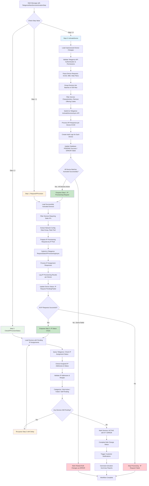

# Telegence Three-Step Activation Flows

## 📊 Overview

The Telegence new service activation process consists of three distinct phases, each handled as separate workflow steps. This document details the specific data flow for each step.

## 🔄 Complete Three-Step Flow Diagram



---

## 📋 Step 0: ActivateDevice Flow

### **Business Context**
This is the core cellular service activation step where SIM cards are provisioned on the Telegence network and become capable of cellular connectivity.

### **Detailed Process Flow**

#### **Input Validation & Setup**
**Code Location**: Lines 2669-2679
```csharp
case (int)TelegenceNewActivationStep.ActivateDevice:
    var changes = GetDeviceChanges(context, bulkChange.Id, bulkChange.PortalTypeId, PageSize);

    if (changes == null || changes.Count == 0)
    {
        LogInfo(context, LogTypeConstant.Warning, $"No unprocessed changes found for new service activation {bulkChange.Id}");
        return true;
    }

    return await ProcessTelegenceNewServiceActivationsAsync(context, logRepo, bulkChange, changes, additionBulkChangeId, retryNumber);
```

**Business Process**:
1. **Retrieve Pending Devices**: Load all unprocessed device activation requests from the database
2. **Validate Request List**: Ensure there are devices to process (empty lists complete successfully)
3. **Route to Processing**: Hand off to the main Telegence activation processor

#### **Authentication & Permission Validation**
**Code Location**: Lines 3017-3040
```csharp
var telegenceApiAuthentication = GetTelegenceApiAuthentication(context.CentralDbConnectionString, serviceProviderId);

if (telegenceApiAuthentication == null)
{
    var errorMessage = $"Unable to get Telegence API Authentication for Service Provider: {serviceProviderId}";
    LogInfo(context, LogTypeConstant.Error, errorMessage);
    await MarkProcessedForNewServiceActivationAsync(context, bulkChange.Id, false, errorMessage, null);
    return false;
}

if (!telegenceApiAuthentication.WriteIsEnabled)
{
    var errorMessage = $"Write is disabled for Service Provider: {serviceProviderId}";
    LogInfo(context, LogTypeConstant.Error, errorMessage);
    await MarkProcessedForNewServiceActivationAsync(context, bulkChange.Id, false, errorMessage, null);
    return false;
}
```

**Business Process**:
1. **Retrieve API Credentials**: Get Telegence authentication for the specific service provider
2. **Validate Access**: Ensure credentials exist and are properly configured
3. **Check Permissions**: Verify write operations are enabled (some accounts are read-only)
4. **Fail Safe**: If any validation fails, mark ALL devices as ERROR to prevent partial processing

#### **Device Request Preparation**
**Code Location**: Lines 3081-3095
```csharp
var telegenceActivationListItems = new List<TelegenceActivationRequest>();
var carrierDataGroup = string.Empty;
var carrierRatePool = string.Empty;
foreach (var change in changes)
{
    LogInfo(context, LogTypeConstant.Info, $"Processing Change: {change.Id} with change request: {change.ChangeRequest}");
    var telegenceChangeRequest = JsonConvert.DeserializeObject<TelegenceActivationChangeRequest>(change.ChangeRequest);

    telegenceActivationListItems.Add(telegenceChangeRequest.TelegenceActivationRequest);
    carrierDataGroup = telegenceChangeRequest.CarrierDataGroup;
    carrierRatePool = telegenceChangeRequest.CarrierRatePool;
}
```

**Business Process**:
1. **Parse Device Requests**: Extract JSON activation requests for each device
2. **Collect Device Details**: ICCID, IMEI, rate plans, service characteristics
3. **Extract Network Parameters**: Carrier data group and rate pool for network routing
4. **Build Activation List**: Prepare devices for batch API calls

#### **Batch Processing & API Calls**
**Code Location**: Lines 3096-3145
```csharp
var isAllBatchesSuccess = true;
var activationListInBatches = telegenceActivationListItems.SplitCollection(MAX_TELEGENCE_SERVICES_PER_REQUEST);
int index = 0;

foreach (var telegenceActivationList in activationListInBatches)
{
    LogInfo(context, CommonConstants.INFO, $"Processing batch {index} of {activationListInBatches.Count()}");
    var httpRetryPolicy = GetHttpRetryPolicy(context);

    // Filter remove ServiceCharacteristic ("remove offering code")
    var tlActivationListSliceRemoveOfferingCode = telegenceActivationList.Select(t => new TelegenceActivationRequest()
    {
        // ... filtering logic
        ServiceCharacteristic = t.Service.ServiceCharacteristic.Where(t => !t.Name.Equals(Common.CommonString.REMOVE_SOC_CODE_STRING)).ToList(),
        // ... other properties
    }).ToList();

    await httpRetryPolicy.ExecuteAsync(async () =>
    {
        apiResult = await _telegenceApiPostClient.ActivateDevicesAsync(tlActivationListSliceRemoveOfferingCode, TelegenceDeviceStatusUpdateURL, httpClient);
    });
}
```

**Business Process**:
1. **Create Batches**: Split devices into groups of 200 (API limit)
2. **Filter Service Codes**: Remove internal offering codes not needed by Telegence
3. **Submit to Telegence**: Send HTTPS activation requests to carrier network
4. **Apply Retry Logic**: Handle temporary network failures automatically
5. **Track Batch Results**: Monitor success/failure of each batch independently

#### **Response Processing & Database Updates**
**Code Location**: Lines 3151-3181
```csharp
foreach (var requestedDevice in telegenceActivationList)
{
    var iccid = requestedDevice.Service.ServiceCharacteristic.FirstOrDefault(sc => sc.Name == "sim")?.Value;

    logRepo.AddMobilityLogEntry(new CreateMobilityDeviceBulkChangeLog()
    {
        BulkChangeId = bulkChange.Id,
        ErrorText = apiResult.HasErrors ? JsonConvert.SerializeObject(apiResult.ResponseObject.TelegenceActivationResponse) : null,
        HasErrors = apiResult.HasErrors,
        LogEntryDescription = "Telegence New Service Activation: Telegence API",
        MobilityDeviceChangeId = (long)(changes.FirstOrDefault(ch => ch.ICCID == iccid)?.Id),
        ProcessBy = "AltaworxDeviceBulkChange",
        ProcessedDate = DateTime.UtcNow,
        ResponseStatus = isSuccessful ? BulkChangeStatus.PENDING : BulkChangeStatus.ERROR,
        RequestText = apiResult.ActionText + Environment.NewLine + JsonConvert.SerializeObject(apiResult.RequestObject),
        ResponseText = apiResult.ResponseObject != null ? JsonConvert.SerializeObject(apiResult.ResponseObject) : string.Empty
    });
}

await MarkProcessedForNewServiceActivationAsync(context, bulkChange.Id, isSuccessful, activationResponse, iccidList, serviceProviderId, userName);
```

**Business Process**:
1. **Process Each Device Response**: Create individual audit logs for each ICCID
2. **Determine Status**: Set PENDING (success) or ERROR (failure) based on Telegence response
3. **Create Audit Trail**: Store complete request/response for compliance and troubleshooting
4. **Update Database**: Mark devices as processed with appropriate status
5. **Prepare for Next Step**: Collect successful ICCIDs for IP provisioning

#### **Next Step Decision**
**Code Location**: Lines 3185-3199
```csharp
if (isAllBatchesSuccess)
{
    await EnqueueDeviceBulkChangesAsync(context, bulkChange.Id, DeviceBulkChangeQueueUrl, SQS_SHORT_DELAY_SECONDS, retryNumber, true,
        serviceProviderId, carrierRatePool, carrierDataGroup, 1, additionBulkChangeId);
}
else
{
    var iccidList = new List<string>();
    var additionBulkChangeDetails = GetDeviceChanges(context, additionBulkChangeId, PortalTypeMobility, int.MaxValue, false);
    // ... handle failures
}
```

**Business Process**:
1. **Evaluate Overall Success**: Check if ALL batches activated successfully
2. **If Successful**: Queue Step 1 (IP Provisioning) with network parameters
3. **If Failed**: Mark related bulk changes as ERROR and stop processing
4. **Preserve Context**: Pass carrier data group and rate pool to next step

---

## 📋 Step 1: RequestIPProvision Flow

### **Business Context**
This step requests static IP addresses for devices that require them, typically for enterprise customers who need fixed IPs for VPN connectivity or firewall configurations.

### **Process Flow Implementation**
**Code Location**: Line 2681
```csharp
case (int)TelegenceNewActivationStep.RequestIPProvision:
    return await ProcessTelegenceStaticIPProvisioning(context, bulkChange, message);
```

### **Detailed Business Process Flow**:

#### **1. Load Successfully Activated Devices**
```csharp
// Expected implementation
var activatedDevices = GetDeviceChanges(context, bulkChange.Id, bulkChange.PortalTypeId, PageSize, false)
    .Where(d => d.Status == BulkChangeStatus.PENDING && d.RequiresStaticIP).ToList();

if (activatedDevices == null || activatedDevices.Count == 0)
{
    LogInfo(context, LogTypeConstant.Info, $"No devices requiring static IP found for bulk change {bulkChange.Id}");
    return true; // Complete this step successfully
}
```

**Business Process**:
- **Retrieve Activated Devices**: Load devices that successfully completed Step 0 activation
- **Filter for IP Requirements**: Identify devices that need static IP addresses (enterprise customers)
- **Validate Request List**: Ensure there are devices requiring IP provisioning

#### **2. Extract Network Configuration & Authentication**
```csharp
// Expected implementation
var serviceProviderId = bulkChange.ServiceProviderId;
var telegenceAuthentication = GetTelegenceApiAuthentication(context.CentralDbConnectionString, serviceProviderId);

// Extract network parameters from SQS message attributes
var carrierDataGroup = message.MessageAttributes.ContainsKey("CarrierDataGroup") 
    ? message.MessageAttributes["CarrierDataGroup"].StringValue : string.Empty;
var carrierRatePool = message.MessageAttributes.ContainsKey("CarrierRatePool") 
    ? message.MessageAttributes["CarrierRatePool"].StringValue : string.Empty;
```

**Business Process**:
- **Retrieve API Credentials**: Get Telegence authentication for IP provisioning endpoints
- **Extract Network Context**: Use carrier data group and rate pool from Step 0
- **Validate Access**: Ensure IP provisioning operations are permitted

#### **3. Prepare IP Provisioning Requests**
```csharp
// Expected implementation
var ipProvisioningRequests = new List<TelegenceStaticIPRequest>();
foreach (var device in activatedDevices)
{
    var deviceChangeRequest = JsonConvert.DeserializeObject<TelegenceActivationChangeRequest>(device.ChangeRequest);
    
    ipProvisioningRequests.Add(new TelegenceStaticIPRequest
    {
        ICCID = device.ICCID,
        SubscriberNumber = deviceChangeRequest.SubscriberNumber,
        CarrierDataGroup = carrierDataGroup,
        CarrierRatePool = carrierRatePool,
        IPPoolId = deviceChangeRequest.StaticIPPoolId,
        CustomerIPRange = deviceChangeRequest.CustomerIPRange
    });
}
```

**Business Process**:
- **Extract Device Details**: Parse ICCID, subscriber numbers, and IP requirements
- **Map IP Pool Assignments**: Determine which IP pools each device should use
- **Prepare Batch Requests**: Group devices for efficient API calls

#### **4. Submit IP Provisioning Requests to Telegence**
```csharp
// Expected implementation
var httpRetryPolicy = GetHttpRetryPolicy(context);
var isAllRequestsSuccessful = true;

await httpRetryPolicy.ExecuteAsync(async () =>
{
    var apiResult = await _telegenceApiPostClient.RequestStaticIPProvisioningAsync(
        ipProvisioningRequests, TelegenceIPProvisioningURL, httpClient);
    
    isAllRequestsSuccessful = !apiResult?.HasErrors ?? false;
    
    // Log results for each device
    foreach (var request in ipProvisioningRequests)
    {
        logRepo.AddMobilityLogEntry(new CreateMobilityDeviceBulkChangeLog()
        {
            BulkChangeId = bulkChange.Id,
            ErrorText = apiResult.HasErrors ? JsonConvert.SerializeObject(apiResult.ResponseObject) : null,
            HasErrors = apiResult.HasErrors,
            LogEntryDescription = "Telegence Static IP Provisioning: Request IP Assignment",
            MobilityDeviceChangeId = activatedDevices.FirstOrDefault(d => d.ICCID == request.ICCID)?.Id ?? 0,
            ProcessBy = "AltaworxDeviceBulkChange",
            ProcessedDate = DateTime.UtcNow,
            ResponseStatus = isAllRequestsSuccessful ? BulkChangeStatus.PENDING : BulkChangeStatus.ERROR,
            RequestText = JsonConvert.SerializeObject(request),
            ResponseText = JsonConvert.SerializeObject(apiResult.ResponseObject)
        });
    }
});
```

**Business Process**:
- **Submit IP Requests**: Send HTTPS requests to Telegence IP management endpoints
- **Handle API Responses**: Process IP allocation confirmations or rejections
- **Create Audit Trail**: Log IP provisioning attempts for each device
- **Apply Retry Logic**: Handle temporary network issues automatically

#### **5. Update Database Status & Queue Next Step**
```csharp
// Expected implementation
foreach (var device in activatedDevices)
{
    await MarkProcessedForNewServiceActivationByICCIDAsync(context, bulkChange.Id, 
        isAllRequestsSuccessful, 
        isAllRequestsSuccessful ? "Static IP provisioning requested" : "Static IP provisioning failed",
        device.ICCID, 
        device.SubscriberNumber, 
        isAllRequestsSuccessful ? BulkChangeStatus.PENDING : BulkChangeStatus.ERROR);
}

if (isAllRequestsSuccessful)
{
    // Queue Step 2 for IP status verification
    await EnqueueDeviceBulkChangesAsync(context, bulkChange.Id, DeviceBulkChangeQueueUrl, 
        SQS_MEDIUM_DELAY_SECONDS, retryNumber, true,
        serviceProviderId, carrierRatePool, carrierDataGroup, 2, additionBulkChangeId);
}
```

**Business Process**:
- **Update Device Status**: Mark devices with IP provisioning request status
- **Database Synchronization**: Ensure internal records reflect IP provisioning state
- **Workflow Progression**: Queue Step 2 only if all IP requests were successful
- **Error Handling**: Stop processing if any IP requests failed

---

## 📋 Step 2: CheckIPProvisionStatus Flow

### **Business Context**
This final step verifies that static IP addresses have been properly assigned and that devices are fully operational with complete service configuration.

### **Process Flow Implementation**
**Code Location**: Line 2683
```csharp
case (int)TelegenceNewActivationStep.CheckIPProvisionStatus:
    return await ProcessTelegenceCheckIPProvision(context, bulkChange, message);
```

### **Detailed Business Process Flow**:

#### **1. Load Devices with Pending IP Assignments**
```csharp
// Expected implementation
var devicesWithPendingIPs = GetDeviceChanges(context, bulkChange.Id, bulkChange.PortalTypeId, PageSize, false)
    .Where(d => d.Status == BulkChangeStatus.PENDING && d.StepName == "RequestIPProvision").ToList();

if (devicesWithPendingIPs == null || devicesWithPendingIPs.Count == 0)
{
    LogInfo(context, LogTypeConstant.Info, $"No devices with pending IP assignments found for bulk change {bulkChange.Id}");
    return await CompleteBulkChangeAsync(context, bulkChange.Id, BulkChangeStatus.PROCESSED);
}
```

**Business Process**:
- **Retrieve Pending Devices**: Load devices that completed IP provisioning requests in Step 1
- **Filter by Status**: Only check devices with pending IP assignments
- **Validate Processing List**: Ensure there are devices requiring status verification

#### **2. Query Telegence for IP Assignment Status**
```csharp
// Expected implementation
var serviceProviderId = bulkChange.ServiceProviderId;
var telegenceAuthentication = GetTelegenceApiAuthentication(context.CentralDbConnectionString, serviceProviderId);
var httpRetryPolicy = GetHttpRetryPolicy(context);

var ipStatusResults = new List<TelegenceIPStatusResult>();

await httpRetryPolicy.ExecuteAsync(async () =>
{
    foreach (var device in devicesWithPendingIPs)
    {
        var statusRequest = new TelegenceIPStatusRequest
        {
            ICCID = device.ICCID,
            SubscriberNumber = device.SubscriberNumber,
            IPProvisioningRequestId = device.IPProvisioningRequestId
        };

        var apiResult = await _telegenceApiPostClient.CheckStaticIPProvisioningStatusAsync(
            statusRequest, TelegenceIPStatusCheckURL, httpClient);
        
        ipStatusResults.Add(new TelegenceIPStatusResult
        {
            Device = device,
            StatusResponse = apiResult,
            AssignedIPAddress = apiResult?.ResponseObject?.AssignedIPAddress,
            ProvisioningStatus = apiResult?.ResponseObject?.Status,
            IsComplete = apiResult?.ResponseObject?.Status == "COMPLETED"
        });
    }
});
```

**Business Process**:
- **Query IP Status**: Check Telegence systems for IP assignment completion status
- **Extract Assignment Details**: Retrieve assigned IP addresses and provisioning status
- **Collect Results**: Aggregate status information for all devices in the batch

#### **3. Validate IP Address Assignments**
```csharp
// Expected implementation
var fullyActivatedDevices = new List<TelegenceIPStatusResult>();
var failedDevices = new List<TelegenceIPStatusResult>();
var stillPendingDevices = new List<TelegenceIPStatusResult>();

foreach (var result in ipStatusResults)
{
    if (result.IsComplete && !string.IsNullOrEmpty(result.AssignedIPAddress))
    {
        // Validate IP address format and range
        if (IsValidIPAddress(result.AssignedIPAddress) && 
            IsWithinCustomerIPRange(result.AssignedIPAddress, result.Device))
        {
            fullyActivatedDevices.Add(result);
        }
        else
        {
            failedDevices.Add(result);
        }
    }
    else if (result.ProvisioningStatus == "FAILED")
    {
        failedDevices.Add(result);
    }
    else
    {
        stillPendingDevices.Add(result);
    }
}
```

**Business Process**:
- **Validate IP Addresses**: Ensure assigned IPs match requested requirements
- **Check IP Ranges**: Verify IPs are within customer's allocated ranges
- **Categorize Results**: Separate devices into fully activated, failed, or still pending
- **Quality Assurance**: Validate IP address format and accessibility

#### **4. Update Device Status and Create Final Audit Logs**
```csharp
// Expected implementation
foreach (var result in fullyActivatedDevices)
{
    // Mark device as fully ACTIVE with assigned IP
    await MarkProcessedForNewServiceActivationByICCIDAsync(context, bulkChange.Id, 
        true, 
        $"Service activation complete. Assigned IP: {result.AssignedIPAddress}",
        result.Device.ICCID, 
        result.Device.SubscriberNumber, 
        BulkChangeStatus.PROCESSED);

    // Create final success log
    logRepo.AddMobilityLogEntry(new CreateMobilityDeviceBulkChangeLog()
    {
        BulkChangeId = bulkChange.Id,
        ErrorText = null,
        HasErrors = false,
        LogEntryDescription = "Telegence Service Activation: Complete with Static IP",
        MobilityDeviceChangeId = result.Device.Id,
        ProcessBy = "AltaworxDeviceBulkChange",
        ProcessedDate = DateTime.UtcNow,
        ResponseStatus = BulkChangeStatus.PROCESSED,
        RequestText = $"ICCID: {result.Device.ICCID}",
        ResponseText = $"Service Active. IP Address: {result.AssignedIPAddress}"
    });
}

foreach (var result in failedDevices)
{
    await MarkProcessedForNewServiceActivationByICCIDAsync(context, bulkChange.Id, 
        false, 
        $"IP provisioning failed: {result.StatusResponse?.ResponseObject?.ErrorMessage}",
        result.Device.ICCID, 
        result.Device.SubscriberNumber, 
        BulkChangeStatus.ERROR);
}
```

**Business Process**:
- **Final Status Update**: Mark devices as ACTIVE or ERROR based on complete service verification
- **IP Address Recording**: Store assigned IP addresses in device records
- **Detailed Audit Trail**: Create comprehensive logs for service completion
- **Error Documentation**: Record specific failure reasons for troubleshooting

#### **5. Handle Pending Devices and Complete Workflow**
```csharp
// Expected implementation
if (stillPendingDevices.Count > 0)
{
    // Some devices still pending IP assignment - retry after delay
    LogInfo(context, LogTypeConstant.Info, 
        $"{stillPendingDevices.Count} devices still pending IP assignment. Will retry in {IP_STATUS_RETRY_DELAY_SECONDS} seconds.");
    
    await EnqueueDeviceBulkChangesAsync(context, bulkChange.Id, DeviceBulkChangeQueueUrl, 
        IP_STATUS_RETRY_DELAY_SECONDS, retryNumber + 1, true,
        serviceProviderId, carrierRatePool, carrierDataGroup, 2, additionBulkChangeId);
}
else
{
    // All devices processed - complete the bulk change
    var overallSuccess = failedDevices.Count == 0;
    var finalStatus = overallSuccess ? BulkChangeStatus.PROCESSED : BulkChangeStatus.ERROR;
    
    await bulkChangeRepository.MarkBulkChangeStatusAsync(context, bulkChange.Id, finalStatus);
    
    if (additionBulkChangeId > 0)
    {
        await bulkChangeRepository.MarkBulkChangeStatusAsync(context, additionBulkChangeId, BulkChangeStatus.PROCESSED);
    }
    
    // Trigger customer notifications and downstream processes
    await TriggerCustomerNotificationAsync(context, bulkChange.Id, fullyActivatedDevices.Count, failedDevices.Count);
}
```

**Business Process**:
- **Retry Logic**: Re-queue status checks for devices still pending IP assignment
- **Workflow Completion**: Mark entire bulk change as PROCESSED or ERROR
- **Customer Notification**: Send completion notifications for successful activations
- **Downstream Integration**: Trigger follow-up workflows (billing, customer assignment, etc.)

#### **6. Service Completion and Reporting**
```csharp
// Expected implementation
private async Task TriggerCustomerNotificationAsync(KeySysLambdaContext context, long bulkChangeId, 
    int successCount, int failureCount)
{
    var notificationPayload = new ServiceActivationCompletionNotification
    {
        BulkChangeId = bulkChangeId,
        TotalDevicesActivated = successCount,
        TotalDevicesFailed = failureCount,
        CompletionTimestamp = DateTime.UtcNow,
        ServiceType = "Telegence Cellular with Static IP"
    };
    
    // Send to customer notification service
    await customerNotificationService.SendActivationCompletionAsync(notificationPayload);
    
    // Generate activation summary report
    await reportingService.GenerateActivationSummaryAsync(bulkChangeId);
}
```

**Business Process**:
- **Customer Communication**: Notify customers of service activation completion
- **Success Metrics**: Report activation success rates and device counts
- **Billing Integration**: Enable billing for successfully activated services
- **Operational Reporting**: Generate summary reports for operations teams

---

## 🔧 Inter-Step Communication

### **SQS Message Attributes**
Each step communicates via SQS message attributes:
```csharp
if (message.MessageAttributes.ContainsKey("TelegenceNewServiceActivationStep"))
{
    processStep = long.Parse(message.MessageAttributes["TelegenceNewServiceActivationStep"].StringValue);
}

// Additional context passed between steps
var carrierDataGroup = message.MessageAttributes.ContainsKey("CarrierDataGroup") 
    ? message.MessageAttributes["CarrierDataGroup"].StringValue : string.Empty;
var carrierRatePool = message.MessageAttributes.ContainsKey("CarrierRatePool") 
    ? message.MessageAttributes["CarrierRatePool"].StringValue : string.Empty;
```

### **Context Preservation**
Critical information passed between steps:
- **Bulk Change ID**: Links all steps to the original request
- **Service Provider ID**: Maintains carrier authentication context
- **Carrier Data Group**: Network routing configuration for IP assignment
- **Carrier Rate Pool**: Billing and IP pool assignments
- **Addition Bulk Change ID**: Related operations (customer assignments)
- **Retry Number**: Tracks retry attempts for each step
- **IP Provisioning Request IDs**: Links devices to their IP requests

### **New Repository Methods Added**

#### **StaticIPProvisioning Repository Method**
```csharp
// Expected repository signature for Step 1
public async Task<DeviceChangeResult<List<TelegenceStaticIPRequest>, TelegenceIPProvisioningResponse>> 
    StaticIPProvisioningAsync(
        List<TelegenceStaticIPRequest> ipRequests,
        TelegenceAuthentication authentication,
        string endpoint)
{
    // Implementation handles:
    // - IP pool validation and availability
    // - Batch IP allocation requests
    // - IP range assignments per customer
    // - Telegence API communication for IP provisioning
}
```

#### **checkIPProvisioning Repository Method**
```csharp
// Expected repository signature for Step 2
public async Task<DeviceChangeResult<List<TelegenceIPStatusRequest>, List<TelegenceIPStatusResult>>> 
    CheckIPProvisioningAsync(
        List<TelegenceIPStatusRequest> statusRequests,
        TelegenceAuthentication authentication,
        string endpoint)
{
    // Implementation handles:
    // - IP assignment status queries
    // - Assigned IP address retrieval
    // - IP provisioning completion verification
    // - Telegence API communication for status checks
}
```

### **Repository Integration Flow**
```csharp
// Step 1: ProcessTelegenceStaticIPProvisioning calls StaticIPProvisioning
var ipProvisioningResult = await repositoryMethod.StaticIPProvisioningAsync(
    ipRequests, telegenceAuth, TelegenceIPProvisioningURL);

// Step 2: ProcessTelegenceCheckIPProvision calls checkIPProvisioning  
var ipStatusResult = await repositoryMethod.CheckIPProvisioningAsync(
    statusRequests, telegenceAuth, TelegenceIPStatusCheckURL);
```

### **Error Handling Between Steps**
- **Step 0 Failure**: Stops entire workflow, prevents billing issues from partial activations
- **Step 1 Failure**: Devices remain active but without static IPs (basic cellular service still works)
- **Step 2 Failure**: Manual intervention required to verify service status and IP assignments
- **Retry Logic**: Each step has independent retry capabilities without affecting completed work

### **Business Continuity Features**
- **Independent Step Processing**: Each step can be retried without affecting previous completed steps
- **Granular Status Tracking**: Device status is updated at each phase for precise progress monitoring
- **Audit Trail Maintenance**: Complete request/response logging at every step for compliance
- **Customer Communication**: Real-time status updates and completion notifications

This three-step architecture with the new repository methods ensures reliable, auditable cellular service activation with complete static IP provisioning for enterprise IoT deployments.