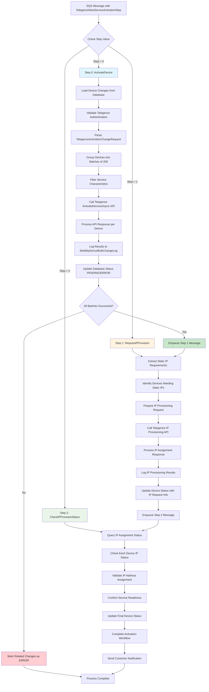

# Telegence Three-Step Activation Flows

## 📊 Overview

The Telegence new service activation process consists of three distinct phases, each handled as separate workflow steps. This document details the specific data flow for each step.

## 🔄 Complete Three-Step Flow Diagram



---

## 📋 Step 0: ActivateDevice Flow

### **Business Context**
This is the core cellular service activation step where SIM cards are provisioned on the Telegence network and become capable of cellular connectivity.

### **Detailed Process Flow**

#### **Input Validation & Setup**
**Code Location**: Lines 2669-2679
```csharp
case (int)TelegenceNewActivationStep.ActivateDevice:
    var changes = GetDeviceChanges(context, bulkChange.Id, bulkChange.PortalTypeId, PageSize);

    if (changes == null || changes.Count == 0)
    {
        LogInfo(context, LogTypeConstant.Warning, $"No unprocessed changes found for new service activation {bulkChange.Id}");
        return true;
    }

    return await ProcessTelegenceNewServiceActivationsAsync(context, logRepo, bulkChange, changes, additionBulkChangeId, retryNumber);
```

**Business Process**:
1. **Retrieve Pending Devices**: Load all unprocessed device activation requests from the database
2. **Validate Request List**: Ensure there are devices to process (empty lists complete successfully)
3. **Route to Processing**: Hand off to the main Telegence activation processor

#### **Authentication & Permission Validation**
**Code Location**: Lines 3017-3040
```csharp
var telegenceApiAuthentication = GetTelegenceApiAuthentication(context.CentralDbConnectionString, serviceProviderId);

if (telegenceApiAuthentication == null)
{
    var errorMessage = $"Unable to get Telegence API Authentication for Service Provider: {serviceProviderId}";
    LogInfo(context, LogTypeConstant.Error, errorMessage);
    await MarkProcessedForNewServiceActivationAsync(context, bulkChange.Id, false, errorMessage, null);
    return false;
}

if (!telegenceApiAuthentication.WriteIsEnabled)
{
    var errorMessage = $"Write is disabled for Service Provider: {serviceProviderId}";
    LogInfo(context, LogTypeConstant.Error, errorMessage);
    await MarkProcessedForNewServiceActivationAsync(context, bulkChange.Id, false, errorMessage, null);
    return false;
}
```

**Business Process**:
1. **Retrieve API Credentials**: Get Telegence authentication for the specific service provider
2. **Validate Access**: Ensure credentials exist and are properly configured
3. **Check Permissions**: Verify write operations are enabled (some accounts are read-only)
4. **Fail Safe**: If any validation fails, mark ALL devices as ERROR to prevent partial processing

#### **Device Request Preparation**
**Code Location**: Lines 3081-3095
```csharp
var telegenceActivationListItems = new List<TelegenceActivationRequest>();
var carrierDataGroup = string.Empty;
var carrierRatePool = string.Empty;
foreach (var change in changes)
{
    LogInfo(context, LogTypeConstant.Info, $"Processing Change: {change.Id} with change request: {change.ChangeRequest}");
    var telegenceChangeRequest = JsonConvert.DeserializeObject<TelegenceActivationChangeRequest>(change.ChangeRequest);

    telegenceActivationListItems.Add(telegenceChangeRequest.TelegenceActivationRequest);
    carrierDataGroup = telegenceChangeRequest.CarrierDataGroup;
    carrierRatePool = telegenceChangeRequest.CarrierRatePool;
}
```

**Business Process**:
1. **Parse Device Requests**: Extract JSON activation requests for each device
2. **Collect Device Details**: ICCID, IMEI, rate plans, service characteristics
3. **Extract Network Parameters**: Carrier data group and rate pool for network routing
4. **Build Activation List**: Prepare devices for batch API calls

#### **Batch Processing & API Calls**
**Code Location**: Lines 3096-3145
```csharp
var isAllBatchesSuccess = true;
var activationListInBatches = telegenceActivationListItems.SplitCollection(MAX_TELEGENCE_SERVICES_PER_REQUEST);
int index = 0;

foreach (var telegenceActivationList in activationListInBatches)
{
    LogInfo(context, CommonConstants.INFO, $"Processing batch {index} of {activationListInBatches.Count()}");
    var httpRetryPolicy = GetHttpRetryPolicy(context);

    // Filter remove ServiceCharacteristic ("remove offering code")
    var tlActivationListSliceRemoveOfferingCode = telegenceActivationList.Select(t => new TelegenceActivationRequest()
    {
        // ... filtering logic
        ServiceCharacteristic = t.Service.ServiceCharacteristic.Where(t => !t.Name.Equals(Common.CommonString.REMOVE_SOC_CODE_STRING)).ToList(),
        // ... other properties
    }).ToList();

    await httpRetryPolicy.ExecuteAsync(async () =>
    {
        apiResult = await _telegenceApiPostClient.ActivateDevicesAsync(tlActivationListSliceRemoveOfferingCode, TelegenceDeviceStatusUpdateURL, httpClient);
    });
}
```

**Business Process**:
1. **Create Batches**: Split devices into groups of 200 (API limit)
2. **Filter Service Codes**: Remove internal offering codes not needed by Telegence
3. **Submit to Telegence**: Send HTTPS activation requests to carrier network
4. **Apply Retry Logic**: Handle temporary network failures automatically
5. **Track Batch Results**: Monitor success/failure of each batch independently

#### **Response Processing & Database Updates**
**Code Location**: Lines 3151-3181
```csharp
foreach (var requestedDevice in telegenceActivationList)
{
    var iccid = requestedDevice.Service.ServiceCharacteristic.FirstOrDefault(sc => sc.Name == "sim")?.Value;

    logRepo.AddMobilityLogEntry(new CreateMobilityDeviceBulkChangeLog()
    {
        BulkChangeId = bulkChange.Id,
        ErrorText = apiResult.HasErrors ? JsonConvert.SerializeObject(apiResult.ResponseObject.TelegenceActivationResponse) : null,
        HasErrors = apiResult.HasErrors,
        LogEntryDescription = "Telegence New Service Activation: Telegence API",
        MobilityDeviceChangeId = (long)(changes.FirstOrDefault(ch => ch.ICCID == iccid)?.Id),
        ProcessBy = "AltaworxDeviceBulkChange",
        ProcessedDate = DateTime.UtcNow,
        ResponseStatus = isSuccessful ? BulkChangeStatus.PENDING : BulkChangeStatus.ERROR,
        RequestText = apiResult.ActionText + Environment.NewLine + JsonConvert.SerializeObject(apiResult.RequestObject),
        ResponseText = apiResult.ResponseObject != null ? JsonConvert.SerializeObject(apiResult.ResponseObject) : string.Empty
    });
}

await MarkProcessedForNewServiceActivationAsync(context, bulkChange.Id, isSuccessful, activationResponse, iccidList, serviceProviderId, userName);
```

**Business Process**:
1. **Process Each Device Response**: Create individual audit logs for each ICCID
2. **Determine Status**: Set PENDING (success) or ERROR (failure) based on Telegence response
3. **Create Audit Trail**: Store complete request/response for compliance and troubleshooting
4. **Update Database**: Mark devices as processed with appropriate status
5. **Prepare for Next Step**: Collect successful ICCIDs for IP provisioning

#### **Next Step Decision**
**Code Location**: Lines 3185-3199
```csharp
if (isAllBatchesSuccess)
{
    await EnqueueDeviceBulkChangesAsync(context, bulkChange.Id, DeviceBulkChangeQueueUrl, SQS_SHORT_DELAY_SECONDS, retryNumber, true,
        serviceProviderId, carrierRatePool, carrierDataGroup, 1, additionBulkChangeId);
}
else
{
    var iccidList = new List<string>();
    var additionBulkChangeDetails = GetDeviceChanges(context, additionBulkChangeId, PortalTypeMobility, int.MaxValue, false);
    // ... handle failures
}
```

**Business Process**:
1. **Evaluate Overall Success**: Check if ALL batches activated successfully
2. **If Successful**: Queue Step 1 (IP Provisioning) with network parameters
3. **If Failed**: Mark related bulk changes as ERROR and stop processing
4. **Preserve Context**: Pass carrier data group and rate pool to next step

---

## 📋 Step 1: RequestIPProvision Flow

### **Business Context**
This step requests static IP addresses for devices that require them, typically for enterprise customers who need fixed IPs for VPN connectivity or firewall configurations.

### **Process Flow (Based on Method Reference)**
**Code Location**: Line 2681
```csharp
case (int)TelegenceNewActivationStep.RequestIPProvision:
    return await ProcessTelegenceStaticIPProvisioning(context, bulkChange, message);
```

### **Expected Business Process Flow**:

#### **IP Requirement Analysis**
1. **Identify Eligible Devices**: Determine which activated devices require static IPs
2. **Extract Network Parameters**: Use carrier data group and rate pool from Step 0
3. **Validate IP Pool Availability**: Check available IP addresses in customer's pool

#### **IP Provisioning Request**
1. **Prepare IP Requests**: Format device list for Telegence IP provisioning API
2. **Submit IP Allocation Request**: Send HTTPS request to Telegence IP management endpoint
3. **Process Response**: Handle IP assignment confirmations or rejections

#### **Status Updates**
1. **Log IP Requests**: Create audit trail for IP provisioning attempts
2. **Update Device Records**: Mark devices with IP request status
3. **Queue Next Step**: Schedule Step 2 for IP status verification

---

## 📋 Step 2: CheckIPProvisionStatus Flow

### **Business Context**
This final step verifies that static IP addresses have been properly assigned and that devices are fully operational with complete service configuration.

### **Process Flow (Based on Method Reference)**
**Code Location**: Line 2683
```csharp
case (int)TelegenceNewActivationStep.CheckIPProvisionStatus:
    return await ProcessTelegenceCheckIPProvision(context, bulkChange, message);
```

### **Expected Business Process Flow**:

#### **IP Status Verification**
1. **Query IP Assignment Status**: Check Telegence systems for IP assignment completion
2. **Validate IP Addresses**: Ensure assigned IPs match requested requirements
3. **Test Connectivity**: Verify devices can communicate using assigned IPs

#### **Service Completion**
1. **Final Status Update**: Mark devices as ACTIVE or ERROR based on complete service verification
2. **Billing Activation**: Enable billing for successfully activated services
3. **Customer Notification**: Send completion notifications for successful activations

#### **Cleanup & Completion**
1. **Update Bulk Change Status**: Mark entire bulk change as PROCESSED or ERROR
2. **Generate Reports**: Create activation summary reports for customers
3. **Trigger Downstream Processes**: Initiate any follow-up workflows (customer assignment, etc.)

---

## 🔧 Inter-Step Communication

### **SQS Message Attributes**
Each step communicates via SQS message attributes:
```csharp
if (message.MessageAttributes.ContainsKey("TelegenceNewServiceActivationStep"))
{
    processStep = long.Parse(message.MessageAttributes["TelegenceNewServiceActivationStep"].StringValue);
}
```

### **Context Preservation**
Critical information passed between steps:
- **Bulk Change ID**: Links all steps to the original request
- **Service Provider ID**: Maintains carrier authentication context
- **Carrier Data Group**: Network routing configuration
- **Carrier Rate Pool**: Billing and IP pool assignments
- **Addition Bulk Change ID**: Related operations (customer assignments)

### **Error Handling Between Steps**
- **Step 0 Failure**: Stops entire workflow, prevents billing issues
- **Step 1 Failure**: Devices remain active but without static IPs (basic service still works)
- **Step 2 Failure**: Manual intervention required to verify service status

This three-step architecture ensures reliable, auditable cellular service activation with complete IP provisioning for enterprise customers.